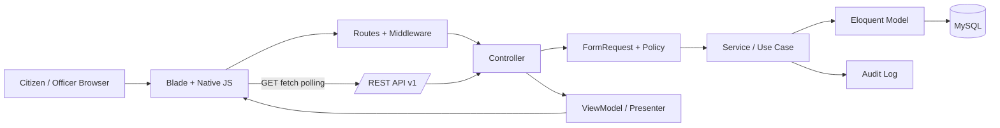
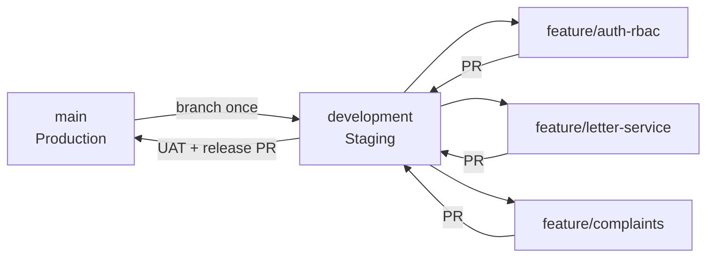

# Project Plan - Platform Layanan Publik Warga

## 1. Purpose

Membangun portal layanan warga tingkat RT/RW yang memusatkan layanan administrasi, pengaduan, informasi kegiatan, transparansi laporan kas, pengelolaan data warga, dan audit perubahan dalam satu sistem web.

Metode formal: **Waterfall**.  
Pola aplikasi: **MVC + lightweight ViewModel/Presenter (half-MVVM)**.  
Stack: **Laravel 11 + Blade + native JavaScript + MySQL + phpMyAdmin**.

## 2. Architecture Overview



### MVC + half-MVVM rule

- Model: Eloquent entity + relations + casts.
- View: Blade components/templates.
- Controller: thin request orchestration.
- Service: business workflow and transactions.
- ViewModel/Presenter: read-only transformation for complex dashboard/table/timeline state.
- Native JS: fetch and UI refresh only; no duplicated business rules in the browser.

## 3. Proposed Repository Structure

```text
platform-layanan-publik-warga/
├─ app/
│  ├─ Enums/
│  ├─ Http/
│  │  ├─ Controllers/
│  │  │  ├─ Public/
│  │  │  ├─ Citizen/
│  │  │  ├─ Admin/
│  │  │  └─ Api/V1/
│  │  ├─ Middleware/
│  │  ├─ Requests/
│  │  └─ Resources/
│  ├─ Models/
│  ├─ Policies/
│  ├─ Services/
│  ├─ ViewModels/
│  ├─ Notifications/
│  └─ Support/
├─ database/
│  ├─ factories/
│  ├─ migrations/
│  └─ seeders/
├─ resources/
│  ├─ views/
│  │  ├─ components/
│  │  ├─ public/
│  │  ├─ citizen/
│  │  └─ admin/
│  ├─ js/
│  │  ├─ api/
│  │  └─ realtime/
│  └─ css/
├─ routes/
│  ├─ web.php
│  ├─ api.php
│  └─ console.php
├─ storage/app/private/
├─ tests/
│  ├─ Feature/
│  └─ Unit/
├─ docs/
└─ .github/
   └─ pull_request_template.md
```

## 4. Core Data Model

Recommended operational tables:

1. `users`
2. `family_cards`
3. `citizens`
4. `letter_types`
5. `letter_requests`
6. `letter_attachments`
7. `cash_categories`
8. `cash_transactions`
9. `financial_reports`
10. `complaints`
11. `complaint_responses`
12. `announcements`
13. `events`
14. `gallery_items`
15. `officials`
16. `security_schedules`
17. `settings`
18. `audit_logs`

### Additional fields for near-real-time and conflict control

For mutable transactional tables, use:

- `created_at DATETIME/TIMESTAMP`
- `updated_at DATETIME/TIMESTAMP` with index where useful
- `version INT UNSIGNED DEFAULT 1` for records with concurrent editing risk
- optional `published_at`, `approved_at`, `closed_at` timestamps

## 5. MySQL and API Type Map

| Domain | MySQL type | API JSON type | Example | Rule |
|---|---|---|---|---|
| ID | BIGINT UNSIGNED | integer/string | `123` | Laravel `$table->id()` |
| NIK/No. KK original | TEXT encrypted | never public | omitted | sensitive |
| NIK/No. KK lookup hash | CHAR(64) | never public | omitted | exact lookup only |
| Name/title | VARCHAR(100-200) | string | `"Surat Domisili"` | bounded length |
| Money | DECIMAL(15,2) | string | `"150000.00"` | avoid FLOAT |
| Status/role | VARCHAR(24-40) | string enum | `"diajukan"` | validate with PHP Enum |
| Dynamic form extension | JSON | object | `{ "purpose": "..." }` | limited use |
| Date | DATE | string | `"2026-10-01"` | ISO date |
| Date-time | DATETIME/TIMESTAMP | string | `"2026-10-01T15:00:00+07:00"` | ISO 8601 |
| Boolean | TINYINT(1) | boolean | `true` | cast in Eloquent |
| Version | INT UNSIGNED | integer | `4` | optimistic locking |
| File path | VARCHAR(255) private | never public | omitted | download via authorized controller |

## 6. Near-Real-Time Read Strategy

### Baseline

Use **MySQL + REST GET + native `fetch()` polling**. This keeps the stack simple and compatible with Blade/native JavaScript.

Recommended intervals:

- Letter/complaint detail status: 5-10 seconds while the page is active.
- Dashboard counters: 10-15 seconds.
- Public announcements/events: 30-60 seconds.
- Stop polling when browser tab is hidden when possible.

### Conditional GET

Use one or more of:

- `ETag` and request header `If-None-Match`
- `Last-Modified` and `If-Modified-Since`
- `updated_since` query parameter
- cursor-based sync endpoint

If no changes exist, return `304 Not Modified` without a full JSON payload.

### Optional later upgrade

If polling causes excessive load, add a dedicated SSE/EventSource endpoint or Laravel broadcasting/Reverb. This is phase 2, not a release-1 dependency.

## 7. GET API Contract

Base URL: `/api/v1`

### Public

| Method | Endpoint | Purpose |
|---|---|---|
| GET | `/public/announcements` | active announcements |
| GET | `/public/events` | event list |
| GET | `/public/finance-reports?period=YYYY-MM` | published financial summary |
| GET | `/public/verify/{token}` | letter authenticity check |
| GET | `/public/track/{ticket}` | minimal ticket status |

### Authenticated citizen

| Method | Endpoint | Purpose |
|---|---|---|
| GET | `/me` | current profile |
| GET | `/letters` | citizen's letter requests |
| GET | `/letters/{id}` | own letter detail |
| GET | `/complaints` | own complaints |
| GET | `/complaints/{id}` | own complaint detail |
| GET | `/dashboard/summary` | role-aware summary |
| GET | `/sync?cursor=...` | incremental changed records |

### Response envelope

```json
{
  "data": {},
  "meta": {
    "request_id": "uuid",
    "version": 4,
    "updated_at": "2026-10-01T15:00:00+07:00"
  },
  "message": "OK"
}
```

### List response

```json
{
  "data": [],
  "meta": {
    "current_page": 1,
    "per_page": 20,
    "total": 120,
    "next_cursor": null
  },
  "message": "OK"
}
```

## 8. Write and Concurrency Rules

- All critical writes use DB transactions.
- Approval of letters and publication of financial reports use `lockForUpdate()` where needed.
- Client submits `version` or `updated_at` when editing concurrency-sensitive records.
- If submitted version is stale, return `409 Conflict`.
- Every critical state transition writes an audit log.

Example transition:

```text
draft -> submitted -> verified -> approved -> completed
                    \-> rejected
```

No illegal transition should be silently accepted.

## 9. Branching and Environment Plan



### `main`

- production-only branch
- no direct feature development
- only approved release PR from `development`
- production configuration: HTTPS, `APP_DEBUG=false`, restricted admin access, production DB credentials, backup enabled

### `development`

- staging/integration branch
- uses separate staging database
- fake/anonymized citizen data only
- all feature PRs merge here first
- UAT and migration rehearsal happen here

### Feature branch naming

- `feature/auth-rbac`
- `feature/citizen-master`
- `feature/letter-service`
- `feature/complaints`
- `feature/finance-transparency`
- `feature/public-content`
- `feature/api-v1`
- `fix/<issue>`
- `docs/<topic>`

## 10. Pull Request Gates

### Feature -> development

Required:

- acceptance criteria complete
- migration runs on clean database
- relevant unit/feature tests pass
- authorization test included
- no secrets committed
- API/docs updated when contract changes

### Development -> main

Required:

- all automated tests pass
- black-box checklist passed
- UAT signed off
- backup created
- staging restore test passed
- migration rehearsal passed
- security checklist passed
- rollback plan documented
- release tag prepared

## 11. Waterfall Deliverables

### Phase 1 - Analysis

Deliverables:

- SRS
- actors/RBAC
- FR/NFR/business rules
- scope and acceptance criteria

### Phase 2 - Design

Deliverables:

- use case/activity/sequence/state diagrams
- ERD and data dictionary
- API contract
- UI sitemap and wireframe
- deployment view

### Phase 3 - Implementation

Deliverables:

- Laravel code
- migrations/seeders
- Blade components
- REST API v1
- tests

### Phase 4 - Testing

Deliverables:

- unit/feature test results
- black-box report
- security tests
- UAT report

### Phase 5 - Deployment

Deliverables:

- staging deployment
- backup/restore evidence
- production release
- health check
- rollback runbook

### Phase 6 - Maintenance

Deliverables:

- change log
- patch log
- backup review
- incident record
- framework upgrade plan

## 12. Release Plan

- `0.1.0-snapshot`: project foundation/auth/RBAC
- `0.2.0-snapshot`: citizen + family data
- `0.3.0-snapshot`: letter workflow
- `0.4.0-snapshot`: complaints + finance
- `0.5.0-snapshot`: public content + API + dashboard
- `0.9.0-rc`: UAT/staging release candidate
- `1.0.0`: first production release

## 13. Security Baseline

- CSRF protection for web forms.
- Sanctum for protected API endpoints.
- Policies for ownership and role authorization.
- Rate limiting on login, public complaint, verification, and tracking endpoints.
- Private storage for attachments.
- MIME/size validation for uploads.
- Sensitive values excluded from logs.
- `.env` excluded from Git.
- Daily database/private storage backup; regular restore test.

## 15. Feature Milestones: Citizen Service & Role API Refactoring (`v0.6.0-snapshot`)

Status: **COMPLETED** (Branch: `feature/citizen-service-role-api`)

- [x] **Phase 1: RBAC Normalization & Least Privilege:**
  - Standardized singular permission scopes (`citizen.read`, `letter.verify`, `finance.manage`, etc.).
  - Added `PETUGAS_KEAMANAN` role to `UserRole` enum.
  - Strict least-privilege boundary: `KETUA_RT` cannot manage finance or system permissions; `WARGA` restricted to own resources.
  - Superadmin automatic bypass logic.
- [x] **Phase 2: Master Letter Catalog & Dynamic Form Schemas:**
  - Database migration extending `jenis_surat` (`template_key`, `template_version`, `form_schema`, `approval_flow`, `estimated_process_hours`).
  - Master seeders for `SK-UMUM`, `SK-KEMATIAN`, `SK-PINDAH`, and `SKTM`.
- [x] **Phase 3: Secure Multipart Letter API & Storage:**
  - Strict multipart validation in `StoreLetterRequest` (MIME, size max 5MB, max 5 files).
  - Private storage in `storage/app/private/letter-attachments/` with ownership-verified downloads.
  - Encrypted NIK with masked presentation (`nik_masked`) in API responses.
- [x] **Phase 4: Explicit Letter Workflow & Concurrency Protection:**
  - State machine: `draft` ➔ `submitted` ➔ `verified` ➔ `approved` ➔ `completed`.
  - Illegal status jumps rejected with `409 Conflict`.
  - Concurrency-safe sequential letter numbering via `document_sequences` table and `lockForUpdate()`.
  - Removal of unsafe fallback users (`Auth::user() ?? User::first()`).
- [x] **Phase 5: Document Templates & DocumentGeneratorService:**
  - 5 official document templates in `resources/views/documents/templates/`.
  - Idempotent document generation, SHA-256 integrity hash, and public non-PII verification token.
- [x] **Phase 6: Security Reports Domain:**
  - Dedicated `security_reports` table, lifecycle, and emergency contacts disclosure for emergency severity.
  - Printable official security report generation.
- [x] **Phase 7 & 8: Testing & Documentation:**
  - 75 automated feature tests (100% passing).
  - Complete documentation: `API_SPEC.md`, `RBAC.md`, `LETTER_WORKFLOW.md`, `DOCUMENT_TEMPLATE.md`.

