# Platform Layanan Publik Warga (Portal Digital RT/RW)

> Sistem Informasi Manajemen Administrasi, Pelayanan Surat Terpadu, Transparansi Kas Keuangan, dan Pengaduan Warga Berbasis Web & Progressive Web App (PWA).

---

## Daftar Isi
1. [Tentang Proyek](#tentang-proyek)
2. [Lingkungan Deployment (Production & Staging)](#lingkungan-deployment-production--staging)
   - [Analisis Teknis: Mengapa Sebelumnya Klik Staging Malah Mendownload File?](#analisis-teknis-mengapa-sebelumnya-klik-staging-malah-mendownload-file)
3. [Tech Stack & Database](#tech-stack--database)
4. [Daftar Akun & Kredensial Pengurus](#daftar-akun--kredensial-pengurus)
5. [Pemodelan Sistem & Rekayasa Perangkat Lunak (5 Unsur Utama)](#pemodelan-sistem--rekayasa-perangkat-lunak-5-unsur-utama)
   - [1. Entity Relationship Diagram (ERD)](#1-entity-relationship-diagram-erd)
   - [2. Logical Record Structure (LRS)](#2-logical-record-structure-lrs)
   - [3. Use Case Diagram & Spesifikasi Use Case](#3-use-case-diagram--spesifikasi-use-case)
   - [4. Activity Diagram](#4-activity-diagram)
   - [5. Unified Modeling Language (UML) Diagrams](#5-unified-modeling-language-uml-diagrams)
     - [5.1. UML Class Diagram](#51-uml-class-diagram)
     - [5.2. UML Sequence Diagram](#52-uml-sequence-diagram)
     - [5.3. UML State Machine Diagram](#53-uml-state-machine-diagram)
   - [6. Flowchart Algoritma Sistem](#6-flowchart-algoritma-sistem)
6. [Fitur Unggulan Antarmuka & Performa Web](#fitur-unggulan-antarmuka--performa-web)
   - [Carousel Warta & Agenda Warga](#1-carousel-warta--agenda-warga)
   - [Navbar 3 Menu Prioritas & Hamburger Drawer](#2-navbar-3-menu-prioritas--hamburger-drawer)
   - [Optimasi Core Web Vitals, LCP & CLS/LFS](#3-optimasi-core-web-vitals-lcp--clslfs)
   - [Metadata SEO & Geolocation (GEO)](#4-metadata-seo--geolocation-geo)
7. [Persiapan Integrasi Firebase Versi Gratis (Spark Plan)](#persiapan-integrasi-firebase-versi-gratis-spark-plan)
8. [Panduan Instalasi & Menjalankan Proyek](#panduan-instalasi--menjalankan-proyek)
9. [Pengujian (Automated Testing)](#pengujian-automated-testing)
10. [Klasifikasi Dokumentasi Teknis (`docs/`)](#klasifikasi-dokumentasi-teknis-docs)

---

## Tentang Proyek

**Platform Layanan Publik Warga** dirancang untuk mendigitalkan birokrasi di tingkat RT/RW secara terstruktur, transparan, dan aman. Platform ini memiliki fitur-fitur unggulan:
- **Verifikasi Warga Instan & Jalur Pendaftaran Mandiri**: Pencocokan NIK berbasis *One-Way Hashing SHA-256* bagi warga sensus terdaftar, serta formulir pengajuan warga baru (*Pending Verification*) dengan proteksi deteksi NIK ganda real-time.
- **Birokrasi Surat Digital 2-Tier**: Verifikasi berkas administratif oleh **Sekretaris**, dilanjutkan dengan persetujuan/tanda tangan digital oleh **Ketua RT**, dengan opsi unduh format resmi **PDF** maupun **Word (.docx)**.
- **Buku Kas Anti-Fraud (*Immutable Ledger*)**: Setiap transaksi kas yang telah dipublikasikan tidak dapat diubah atau dihapus sembarangan, melainkan harus melalui proses pembalik (*reversal ledger*) yang tercatat di audit log.
- **Real-Time Notification**: Terintegrasi dengan **Pusher Channels** dan **Web Push Notifications (PWA)** sehingga warga dan pengurus menerima notifikasi langsung di perangkat masing-masing.
- **Tampilan Ramah Pengguna**: Mengusung *Clean Light Theme Only*, tipografi Google Fonts Inter, ikonografi Lucide, dan interaktivitas Alpine.js dengan umpan balik animasi (efek *shake* kartu dan pesan validasi visual).

---

## Lingkungan Deployment (Production & Staging)

Sistem ini mendukung arsitektur multi-environment yang sinkron secara berkala:

| Parameter | 🚀 Production Environment (Railway) | 🧪 Staging Environment (Vercel) |
|---|---|---|
| **Public URL** | [platform-layanan-publik-warga.up.railway.app](https://platform-layanan-publik-warga.up.railway.app) | [platform-layanan-publik-warga.vercel.app](https://platform-layanan-publik-warga.vercel.app) |
| **Backend Runtime** | PHP 8.4 + Laravel 12 MVC Framework | Python 3.12 + FastAPI Serverless Functions (`api/index.py`) |
| **Database Engine** | MySQL 8.0 Enterprise Relational DB | PostgreSQL 16 (Neon Serverless Cloud Database) |
| **Frontend Rendering** | Blade Engine + Tailwind CSS v4 + Alpine.js | Interactive Staging Dashboard (`public/index.html`) + API Tester |
| **API Documentation** | OpenAPI 3.1 Swagger UI (`/docs/api`) | Interactive Swagger UI (`/api/docs`) |
| **Target Pengguna** | Warga RT & Pengurus Aktif (Operasional Nyata) | Pengujian Fitur, QA, UAT, dan Integrasi Serverless |

### Analisis Teknis: Mengapa Sebelumnya Klik Staging Malah Mendownload File?

Saat pertama kali URL Staging diakses pada platform Vercel, browser pengguna mengalami gejala **otomatis mengunduh berkas (*download binary/stream*)** alih-alih menampilkan halaman web. Berikut analisis teknis dan solusi yang telah diselesaikan:

1. **Akar Permasalahan (*Root Cause*)**:
   - Struktur repositori berbasis **Laravel** memiliki direktori publik standar yaitu `public/`, di mana berkas entry-point utamanya adalah `public/index.php`.
   - Vercel secara default mendeteksi repositori web dan menetapkan direktori keluaran statis pada `outputDirectory: "public"`.
   - Tanpa adanya runtime serverless PHP bawaan pada infrastruktur dasar Vercel, server Vercel memperlakukan berkas `index.php` sebagai **berkas statis non-eksekutabel**.
   - Akibatnya, server web Vercel mengirimkan header respons HTTP:
     ```http
     Content-Type: application/octet-stream (atau application/x-httpd-php)
     Content-Disposition: attachment; filename="index.php"
     ```
     Header ini memaksa browser mengunduh isi mentah script `index.php` ke folder download komputer pengguna.

2. **Solusi Arsitektur yang Diterapkan**:
   - **Penyediaan `public/index.html` Interaktif**: Dibuat berkas antarmuka `public/index.html` bergaya modern (Tailwind CSS, Lucide Icons) dengan fitur *Live API Sandbox Tester*, pintasan Swagger Docs, dan status koneksi Neon PostgreSQL. Dalam aturan prioritas Vercel, berkas `index.html` selalu disajikan di rute root `/` sebagai dokumen web (`Content-Type: text/html; charset=utf-8`), sehingga file `index.php` tidak lagi disajikan sebagai unduhan.
   - **Transisi Backend Staging ke FastAPI Serverless**: Dibuat modul Python 3.12 berbasis FastAPI di `api/index.py` yang menangani semua endpoint API staging (`/api/v1/check-citizen`, `/api/v1/register`, `/api/v1/letters/download`, dll.) dan terhubung langsung ke **PostgreSQL Neon**.
   - **Konfigurasi Routing Vercel (`vercel.json`)**: Ditetapkan rewrite rules yang memisahkan lalu lintas statis (`/` ke `public/index.html`) dan lalu lintas backend (`/api/(.*)` ke `api/index.py`), memastikan pengalaman pengguna mulus tanpa unduhan tidak terduga.

---

## Tech Stack & Database

| Komponen | Teknologi | Keterangan |
|---|---|---|
| **Backend Framework** | **Laravel 11 / 12 / 13** (PHP 8.4) & **FastAPI** (Python 3.12) | Laravel MVC di Production (Railway), FastAPI Serverless di Staging (Vercel) |
| **Database Produksi** | **MySQL / MariaDB via phpMyAdmin** | Relasi antar tabel dengan Foreign Key Constraints & Indexing |
| **Database Staging** | **PostgreSQL 16 (Neon Serverless Cloud)** | Fully Managed Serverless Cloud Postgres dengan Connection Pooling |
| **Database Development/Testing**| **SQLite (In-Memory / File)** | Digunakan untuk eksekusi Feature Testing dan CI/CD cepat |
| **Frontend Styling** | **Tailwind CSS v4** | Desain responsif modern berorientasi Light Mode elegan |
| **Frontend Interactivity** | **Alpine.js v3** | Reactive client-side validation, NIK counter, password toggle, animasi *shake* |
| **Ikonografi & Font** | **Lucide Icons & Google Fonts (Inter)** | Tampilan bersih, profesional, dan mudah dibaca oleh semua usia warga |
| **Real-time Broadcasting** | **Pusher Channels & Laravel Echo** | Siaran instan saat ada warga baru mendaftar atau status surat diperbarui |
| **Mobile & Offline Support** | **Progressive Web App (PWA)** | Service Worker Cache-First, Web App Manifest, Fallback Halaman Offline |
| **Code Formatter & QA** | **Laravel Pint & PHPUnit** | Standardisasi PSR-12 dan 150 Automated Feature Tests (100% Passed) |

### Konfigurasi Koneksi Database (MySQL / phpMyAdmin)
Untuk menghubungkan aplikasi ke MySQL via **phpMyAdmin / XAMPP**:
```env
DB_CONNECTION=mysql
DB_HOST=127.0.0.1
DB_PORT=3306
DB_DATABASE=layanan_publik_warga
DB_USERNAME=root
DB_PASSWORD=
```

---

## Daftar Akun & Kredensial Pengurus

Sistem telah dilengkapi data awal pengurus RT (**Seeders**) yang siap digunakan untuk login tanpa perlu membuat akun tiruan (*dummy*):

| Role Pengguna | Kategori | Email Login | Password Default | Wewenang & Hak Akses Fitur |
|---|---|---|---|---|
| **SUPERADMIN** | Sistem Administrator | `superadmin@warga.local` | `password` | **Akses Penuh Tanpa Batas**:<br>• Manajemen sistem, permission, role user.<br>• Akses semua modul data warga, surat, keuangan, subfolder laporan, dan audit trail. |
| **KETUA_RT** | Pengurus Inti | `ketua_rt@warga.local` | `password` | **Persetujuan Akhir & Supervisi**:<br>• Pengesahan/Persetujuan akhir Surat Pengantar (`letter.approve`).<br>• Monitoring transparansi kas, tinjau laporan keuangan RT, & tindak lanjut aduan warga.<br>• Supervisi kependudukan lingkungan RT. |
| **SEKRETARIS** | Pengurus Administrasi | `sekretaris@warga.local` | `password` | **Administrasi, Pengumuman & Akses Laporan Kas**:<br>• Verifikasi kelengkapan berkas surat warga (`letter.verify`).<br>• Pengelolaan master data kependudukan RT (`citizen.manage`).<br>• Template surat (`letter.template.manage`) & Agenda Pengumuman (`announcement.manage`).<br>• Akses unduh Laporan Kas RT Bulanan & Rekapitulasi Kas Pembayaran Iuran Warga dari subfolder privat. |
| **BENDAHARA** | Pengurus Keuangan | `bendahara@warga.local` | `password` | **Tata Kelola Keuangan Kas & Backup Store** (`finance.manage`, `finance.report`):<br>• Pencatatan kas masuk (iuran warga) & kas keluar.<br>• Unduh Laporan Kas RT Bulanan (.HTML / .CSV) & Kas Pembayaran Iuran Warga Per Bulan dari subfolder privat `storage/app/private/financial-reports/`.<br>• Jalankan snapshot *Immutable Backup Store* data keuangan terenkripsi dengan verifikasi *Checksum SHA-256*.<br>• Reversal audit transaksi kas jika ada koreksi data. |
| **PETUGAS_KEAMANAN** | Keamanan Lingkungan | `keamanan@warga.local` | `password` | **Pengelolaan Keamanan & Ketertiban** (`security.manage`):<br>• Manajemen & penugasan laporan insiden keamanan (`security_reports`).<br>• Investigasi dan resolusi tiket keamanan warga.<br>• Pengelolaan jadwal ronda lingkungan & kontak darurat. |
| **WARGA** | Pengguna Publik | *(Sesuai registrasi warga)* | *(Ditentukan warga)* | **Layanan Mandiri Warga**:<br>• Mengajukan surat pengantar mandiri (`letter.create`).<br>• Tracking status surat & verifikasi keaslian surat via token.<br>• Unduh dokumen resmi dalam format **PDF** atau **Word (.docx)**.<br>• Mengirimkan aduan lingkungan lengkap dengan foto kamera.<br>• Melihat laporan transparansi kas & pengumuman RT. |

---

## Pemodelan Sistem & Rekayasa Perangkat Lunak (5 Unsur Utama)

Sebagai pemenuhan standar dokumentasi rekayasa perangkat lunak (*Software Engineering Documentation*), sistem ini didokumentasikan secara komprehensif melalui **5 Unsur Pemodelan Sistem**:
1. **Entity Relationship Diagram (ERD)**
2. **Logical Record Structure (LRS)**
3. **Use Case Diagram & Spesifikasi Use Case**
4. **Activity Diagram**
5. **Unified Modeling Language (UML) Diagrams** (Class, Sequence, dan State Machine Diagram)

---

### 1. Entity Relationship Diagram (ERD)

Diagram relasi entitas basis data relasional yang memperlihatkan struktur tabel lengkap, tipe data, kunci primer/asing, serta **kardinalitas relasi secara eksplisit (*One-to-One [1:1]*, *One-to-Many [1:N]*, dan resolusi *Many-to-Many [M:N]*)**.

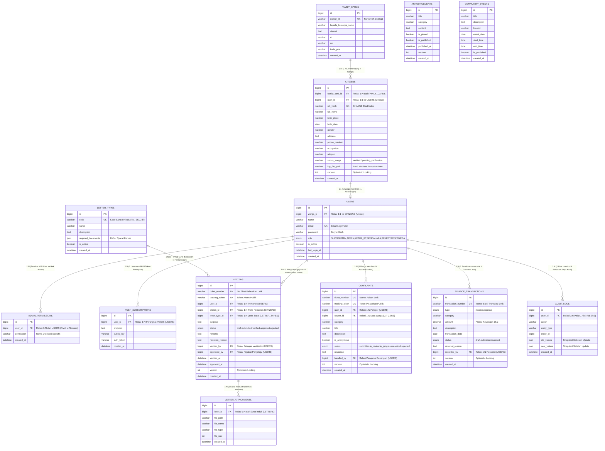

#### Matriks Klasifikasi Kardinalitas Relasi (ERD)

| Entitas Asal (Parent) | Entitas Tujuan (Child) | Kardinalitas | Kunci Relasi (PK ➔ FK) | Penjelasan Logika Bisnis & Mekanisme Relasi |
| :--- | :--- | :---: | :--- | :--- |
| **`FAMILY_CARDS`** | **`CITIZENS`** | **`1 : N`** (One-to-Many) | `FAMILY_CARDS.id` ➔ `CITIZENS.family_card_id` | **Satu** Kartu Keluarga menaungi **banyak** anggota keluarga warga RT. Satu warga wajib terdaftar pada tepat satu KK. |
| **`CITIZENS`** | **`USERS`** | **`1 : 1`** (One-to-One) | `CITIZENS.user_id` ➔ `USERS.id`<br>`USERS.warga_id` ➔ `CITIZENS.id` | **Satu** data kependudukan warga memiliki tepat **satu** akun login portal (relasi bi-directional dengan batas `UNIQUE` constraint). |
| **`USERS`** | **`ADMIN_PERMISSIONS`** | **`1 : N`** *(Pecahan M:N)* | `USERS.id` ➔ `ADMIN_PERMISSIONS.user_id` | **Satu** akun pengguna dapat memiliki **banyak** hak akses granular (*role-permission assignment*). |
| **`LETTER_TYPES`** | **`LETTERS`** | **`1 : N`** (One-to-Many) | `LETTER_TYPES.id` ➔ `LETTERS.letter_type_id` | **Satu** jenis formulir surat (SKTM, SKU, dll.) digunakan sebagai template permohonan oleh **banyak** surat warga. |
| **`USERS`** | **`LETTERS`** | **`1 : N`** (One-to-Many) | `USERS.id` ➔ `LETTERS.user_id` | **Satu** akun warga dapat mengajukan **banyak** surat pengantar sepanjang waktu. |
| **`LETTERS`** | **`LETTER_ATTACHMENTS`**| **`1 : N`** (One-to-Many) | `LETTERS.id` ➔ `LETTER_ATTACHMENTS.letter_id` | **Satu** berkas surat permohonan dapat memiliki **banyak** lampiran dokumen pendukung (KTP, KK, Bukti Bayar, dll.). |
| **`USERS`** | **`COMPLAINTS`** | **`1 : N`** (One-to-Many) | `USERS.id` ➔ `COMPLAINTS.user_id` | **Satu** warga dapat menyampaikan **banyak** laporan keluhan aspirasi lingkungan RT. |
| **`USERS`** | **`FINANCE_TRANSACTIONS`** | **`1 : N`** (One-to-Many) | `USERS.id` ➔ `FINANCE_TRANSACTIONS.recorded_by` | **Satu** pengurus kas (Bendahara) dapat mencatat dan mengelola **banyak** mutasi kas masuk/keluar. |
| **`USERS`** | **`AUDIT_LOGS`** | **`1 : N`** (One-to-Many) | `USERS.id` ➔ `AUDIT_LOGS.user_id` | **Satu** pengguna dapat memicu **banyak** baris pencatatan jejak audit audit trail sistem. |
| **`USERS`** | **`PUSH_SUBSCRIPTIONS`**| **`1 : N`** (One-to-Many) | `USERS.id` ➔ `PUSH_SUBSCRIPTIONS.user_id` | **Satu** pengguna dapat mendaftarkan **banyak** token browser/perangkat mobile untuk WebPush Notification. |

---

### 2. Logical Record Structure (LRS)

Representasi relasional tabel skema database dengan relasi kunci utama (*Primary Key* / `PK`), kunci tamu (*Foreign Key* / `FK`), serta penanda kardinalitas relasi **`[1:1]`**, **`[1:N]`**, dan **`[M:N (Tabel Pivot/Perantara)]`**:

```
┌────────────────────────────────────────────────────────┐
│                      FAMILY_CARDS                      │
├────────────────────────────────────────────────────────┤
│ PK   id                                                │
│      nomor_kk (Unique, 16 Digit)                       │
│      kepala_keluarga_name, alamat, rt, rw, kode_pos    │
└───────────────────────────┬────────────────────────────┘
                            │
                            │ [1:N] (One-to-Many)
                            ▼
┌────────────────────────────────────────────────────────┐                [1:1] (One-to-One)               ┌────────────────────────────────────────────────────────┐
│                        CITIZENS                        ├────────────────────────────────────────────────►│                         USERS                          │
├────────────────────────────────────────────────────────┤                                                 ├────────────────────────────────────────────────────────┤
│ PK   id                                                │                                                 │ PK   id                                                │
│ FK   family_card_id ───────────────────────────────────┼── (Relasi 1:N dari FAMILY_CARDS)                │ FK   warga_id (Unique) ────────────────────────────────┤ (Relasi 1:1 ke CITIZENS)
│ FK   user_id (Unique) ─────────────────────────────────┼── (Relasi 1:1 ke USERS)                         │      name, email (Unique), password (Bcrypt)           │
│      nik_hash (Unique, SHA-256), full_name             │                                                 │      role (SUPERADMIN, KETUA_RT, BENDAHARA, ..), active│
│      birth_place, birth_date, gender, address, phone   │                                                 └────────┬──────────────┬──────────────┬──────────────┬───┘
│      occupation, religion, status_warga, ktp_file_path │                                                          │ [1:N]        │ [1:N]        │ [1:N]        │ [1:N]
│      version (Optimistic Locking)                      │                                                          ▼              ▼              ▼              │
└───────────────────────────┬────────────────────────────┘                                                 ┌────────────────┐┌────────────┐┌─────────────┐       │
                            │ [1:N]                                                                        │ADMIN_PERMISSION││ AUDIT_LOGS ││PUSH_SUBSCRIP│       │
                            ▼                                                                              ├────────────────┤├────────────┤├─────────────┤       │
┌────────────────────────────────────────────────────────┐                                                 │PK  id          ││PK  id      ││PK  id       │       │
│                        LETTERS                         │                                                 │FK  user_id     ││FK  user_id ││FK  user_id  │       │
├────────────────────────────────────────────────────────┤                                                 │    permission  ││    action  ││    endpoint │       │
│ PK   id                                                │                                                 └────────────────┘└────────────┘└─────────────┘       │
│      ticket_number (Unique), tracking_token (Unique)   │                                                  [M:N Pivot Table]                                    │
│ FK   user_id ──────────────────────────────────────────┼── (Relasi 1:N dari USERS Pemohon)                                                                     │
│ FK   citizen_id ───────────────────────────────────────┼── (Relasi 1:N dari Profil CITIZENS)              ┌──────────────────────────────────────────────┐      │
│ FK   letter_type_id ◄──────────┐                       │                                                 │             FINANCE_TRANSACTIONS             │◄─────┘
│      purpose, status (submitted..approved), version    │                                                 ├──────────────────────────────────────────────┤
│ FK   verified_by (Users.id)    │ [1:N]                 │                                                 │ PK   id                                      │
│ FK   approved_by (Users.id)    │                       │                                                 │      transaction_number (Unique)             │
│      output: PDF / Word .docx  │                       │                                                 │      type (income, expense), category, amount│
└───────────────────────────┬────┴───────────────────────┘                                                 │      description, date, status, reversal     │
                            │                                                                              │ FK   recorded_by (Users.id) ─────────────────┼── (Relasi 1:N Pencatat)
                            │ [1:N] (One-to-Many)                                                          │      version (Optimistic Lock)               │
                            ▼                                                                              └──────────────────────────────────────────────┘
┌────────────────────────────────────────────────────────┐  ┌───────────────────────────────────────────┐
│                   LETTER_ATTACHMENTS                   │  │               LETTER_TYPES                │  ┌──────────────────────────────────────────────┐
├────────────────────────────────────────────────────────┤  ├───────────────────────────────────────────┤  │                  COMPLAINTS                  │
│ PK   id                                                │  │ PK   id                                   │  ├──────────────────────────────────────────────┤
│ FK   letter_id ────────────────────────────────────────┤  │      code (Unique, SKTM/SKU), name, desc  │  │ PK   id                                      │
│      file_path, file_name, file_type, file_size        │  │      required_documents (JSON), is_active │  │      ticket_number (Unique), tracking_token  │
└────────────────────────────────────────────────────────┘  └─────────────────────┬─────────────────────┘  │ FK   user_id (Users.id) ─────────────────────┼── (Relasi 1:N Pembuat Aduan)
                                                                                  │ [1:N]                  │ FK   citizen_id (Citizens.id)                │
                                                                                  └────────────────────────┤      category, title, description, status    │
                                                                                                           │ FK   handled_by (Users.id)                   │
                                                                                                           └──────────────────────────────────────────────┘
```

#### Notasi Relasional LRS (Relational Mapping Notation)
Menunjukkan struktur relasi antar tabel secara formal (`PK = Primary Key Garis Bawah`, `FK = Foreign Key Prefix #`):

1. **`FAMILY_CARDS`** (<u>id</u>, *nomor_kk*, kepala_keluarga_name, alamat, rt, rw, kode_pos, created_at)
2. **`CITIZENS`** (<u>id</u>, **#family_card_id** *(1:N)*, **#user_id** *(1:1 Unique)*, *nik_hash*, full_name, birth_place, birth_date, gender, address, phone_number, occupation, religion, status_warga, ktp_file_path, version, created_at)
3. **`USERS`** (<u>id</u>, **#warga_id** *(1:1 Unique)*, name, *email*, password, role, is_active, last_login_at, created_at)
4. **`ADMIN_PERMISSIONS`** (<u>id</u>, **#user_id** *(1:N / Resolusi M:N)*, permission, created_at)
5. **`LETTER_TYPES`** (<u>id</u>, *code*, name, description, required_documents, is_active, created_at)
6. **`LETTERS`** (<u>id</u>, *ticket_number*, *tracking_token*, **#user_id** *(1:N)*, **#citizen_id** *(1:N)*, **#letter_type_id** *(1:N)*, purpose, status, remarks, rejection_reason, **#verified_by** *(1:N)*, **#approved_by** *(1:N)*, verified_at, approved_at, version, created_at)
7. **`LETTER_ATTACHMENTS`** (<u>id</u>, **#letter_id** *(1:N)*, file_path, file_name, file_type, file_size, created_at)
8. **`COMPLAINTS`** (<u>id</u>, *ticket_number*, *tracking_token*, **#user_id** *(1:N)*, **#citizen_id** *(1:N)*, category, title, description, is_anonymous, status, response, **#handled_by** *(1:N)*, version, created_at)
9. **`FINANCE_TRANSACTIONS`** (<u>id</u>, *transaction_number*, type, category, amount, description, transaction_date, status, reversal_reason, **#recorded_by** *(1:N)*, version, created_at)
10. **`AUDIT_LOGS`** (<u>id</u>, **#user_id** *(1:N)*, action, entity_type, entity_id, old_values, new_values, created_at)
11. **`PUSH_SUBSCRIPTIONS`** (<u>id</u>, **#user_id** *(1:N)*, endpoint, public_key, auth_token, created_at)
12. **`ANNOUNCEMENTS`** (<u>id</u>, title, category, content, is_pinned, is_published, published_at, version, created_at)
13. **`COMMUNITY_EVENTS`** (<u>id</u>, title, description, location, event_date, start_time, end_time, is_published, created_at)

---

### 3. Use Case Diagram & Spesifikasi Use Case

Diagram use case memetakan interaksi seluruh aktor (Warga Terdaftar, Pemohon Warga Baru, Sekretaris, Bendahara, Ketua RT, dan Superadmin) dengan fitur sistem.

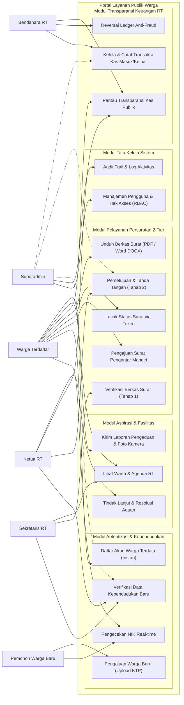

#### Spesifikasi Use Case (Use Case Specifications)

| ID Use Case | Nama Use Case | Aktor Utama | Kondisi Awal (*Pre-condition*) | Alur Utama (*Main Scenario*) | Kondisi Akhir (*Post-condition*) |
|---|---|---|---|---|---|
| **UC-01** | Pengecekan NIK Real-time | Warga / Pemohon | Pengguna berada di halaman registrasi portal | 1. Input 16 digit NIK.<br>2. Sistem kueri database via hashing SHA-256.<br>3. Menampilkan status: terdaftar, sudah punya akun, atau belum ada di sensus RT. | UI memberikan umpan balik instan; tombol "Ajukan Warga Baru" muncul hanya jika NIK belum terdaftar. |
| **UC-02** | Pengajuan Warga Baru | Pemohon Baru | NIK belum tercatat di data sensus RT | 1. Pemohon isi nama, NIK, alamat, telepon, dan unggah foto KTP.<br>2. Sistem simpan data dengan status `pending_verification`. | Notifikasi terkirim ke Pengurus; akun belum dapat mengakses surat sampai disetujui. |
| **UC-03** | Pengajuan Surat Pengantar | Warga Terdaftar | Warga telah login dan berstatus `verified` | 1. Pilih jenis surat (SKTM, SKU, dll).<br>2. Lengkapi keperluan & unggah berkas pendukung.<br>3. Klik kirim permohonan. | Diterbitkan nomor tiket unik dan status surat menjadi `submitted`. |
| **UC-04** | Verifikasi Berkas (Tier 1) | Sekretaris RT | Surat berstatus `submitted` | 1. Sekretaris buka menu verifikasi.<br>2. Evaluasi kesesuaian berkas lampiran.<br>3. Klik verifikasi berkas (atau tolak dengan alasan). | Status berubah menjadi `verified` dan masuk ke antrian Ketua RT. |
| **UC-05** | Pengesahan Surat (Tier 2) | Ketua RT | Surat berstatus `verified` | 1. Ketua RT tinjau draf surat.<br>2. Berikan persetujuan akhir & bubuhkan stempel digital.<br>3. Sistem generate token verifikasi resmi. | Status surat menjadi `approved`; QR Code & berkas final siap diunduh warga. |
| **UC-06** | Unduh Surat (PDF / DOCX) | Warga Terdaftar | Surat berstatus `approved` | 1. Warga klik tombol unduh pada dashboard atau riwayat.<br>2. Pilih format dokumen: **Unduh PDF** atau **Unduh Word (.docx)**.<br>3. Sistem stream binary file langsung ke perangkat. | Dokumen resmi terunduh dengan format yang dipilih warga; jika surat belum disetujui, muncul modal edukatif. |
| **UC-07** | Reversal Transaksi Kas | Bendahara RT | Transaksi kas berstatus `published` memiliki koreksi | 1. Bendahara pilih transaksi yang keliru.<br>2. Masukkan alasan pembatalan resmi.<br>3. Sistem generate transaksi pembalik bertanda lawan otomatis. | Transaksi asal menjadi `reversed`; saldo terkoreksi tanpa manipulasi history; audit log tercatat. |

---

### 4. Activity Diagram

#### A. Alur Validasi NIK & Pendaftaran Warga (Dual-Flow: Sensus vs Warga Baru)
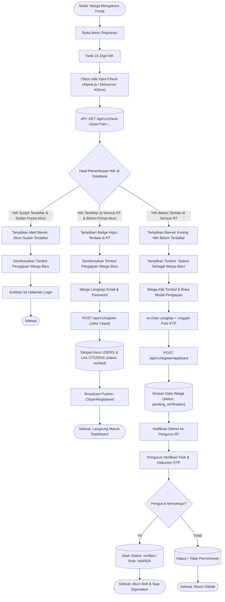

#### B. Alur Pengajuan, Verifikasi 2-Tier, dan Unduh Surat (Format PDF / DOCX)
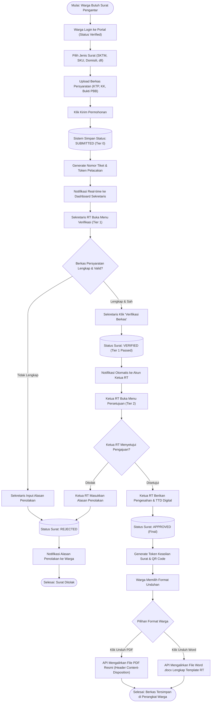

#### C. Alur Tata Kelola Kas RT & Reversal Ledger Anti-Fraud
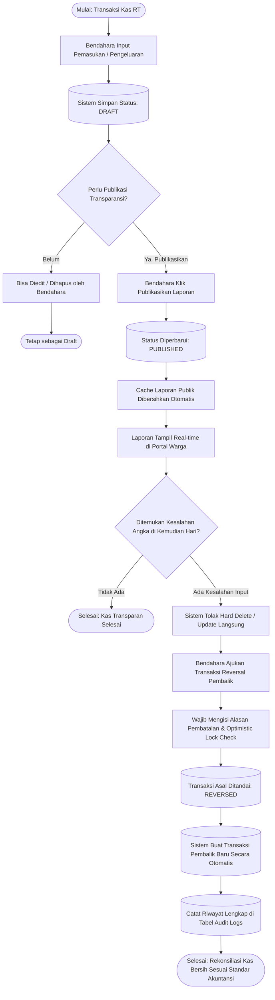

---

### 5. Unified Modeling Language (UML) Diagrams

#### 5.1. UML Class Diagram
Diagram kelas memetakan domain model utama, tipe data atribut, visibilitas method (`+` public, `-` private, `#` protected), dan relasi asosiasi/komposisi:

```mermaid
classDiagram
    direction TB

    class User {
        +bigint id
        +bigint warga_id
        +string name
        +string email
        +string password
        +string role
        +boolean is_active
        +datetime last_login_at
        +login(credentials) bool
        +logout() void
        +hasPermission(permission) bool
        +citizen() Citizen
    }

    class Citizen {
        +bigint id
        +bigint family_card_id
        +bigint user_id
        +string nik_hash
        +string full_name
        +string birth_place
        +date birth_date
        +string gender
        +string phone_number
        +string status_warga
        +string ktp_file_path
        +int version
        +checkNikHash(hash) bool
        +linkAccount(userId) void
        +isVerified() bool
    }

    class FamilyCard {
        +bigint id
        +string nomor_kk
        +string kepala_keluarga_name
        +string alamat
        +string rt
        +string rw
        +getMembers() Collection
    }

    class Letter {
        +bigint id
        +string ticket_number
        +string tracking_token
        +bigint user_id
        +bigint citizen_id
        +bigint letter_type_id
        +string purpose
        +string status
        +string remarks
        +string rejection_reason
        +bigint verified_by
        +bigint approved_by
        +datetime verified_at
        +datetime approved_at
        +int version
        +submit() void
        +verify(sekretarisId) bool
        +approve(ketuaRtId) bool
        +reject(reason, userId) bool
        +downloadPdf() BinaryResponse
        +downloadDocx() BinaryResponse
    }

    class LetterType {
        +bigint id
        +string code
        +string name
        +text description
        +json required_documents
        +boolean is_active
        +letters() Collection
    }

    class LetterAttachment {
        +bigint id
        +bigint letter_id
        +string file_path
        +string file_name
        +string file_type
        +int file_size
        +getStorageUrl() string
    }

    class FinanceTransaction {
        +bigint id
        +string transaction_number
        +string type
        +string category
        +decimal amount
        +string description
        +date transaction_date
        +string status
        +string reversal_reason
        +bigint recorded_by
        +int version
        +publish() bool
        +reverse(reason, userId) FinanceTransaction
    }

    class Complaint {
        +bigint id
        +string ticket_number
        +string tracking_token
        +bigint user_id
        +bigint citizen_id
        +string category
        +string title
        +text description
        +boolean is_anonymous
        +string status
        +text response
        +bigint handled_by
        +resolve(response, userId) bool
    }

    FamilyCard "1" *-- "0..*" Citizen : menaungi
    Citizen "1" <--> "0..1" User : terhubung (1:1)
    User "1" --> "0..*" Letter : mengajukan
    Citizen "1" --> "0..*" Letter : subjek pemohon
    LetterType "1" --> "0..*" Letter : mengkategorikan
    Letter "1" *-- "0..*" LetterAttachment : memiliki berkas
    User "1" --> "0..*" FinanceTransaction : mencatat
    User "1" --> "0..*" Complaint : melapor
    Citizen "1" --> "0..*" Complaint : profil pelapor
```

#### 5.2. UML Sequence Diagram

##### A. Pengecekan NIK Real-time & Pendaftaran Warga Baru
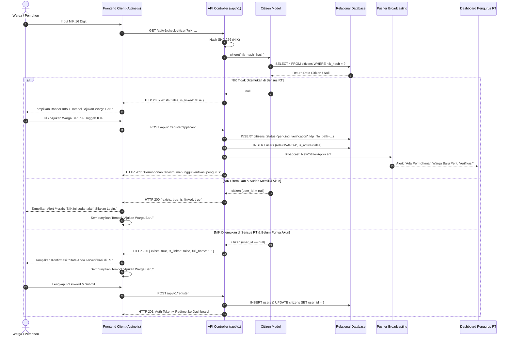

##### B. Siklus Pengajuan Surat 2-Tier hingga Unduh Dokumen (PDF / DOCX)
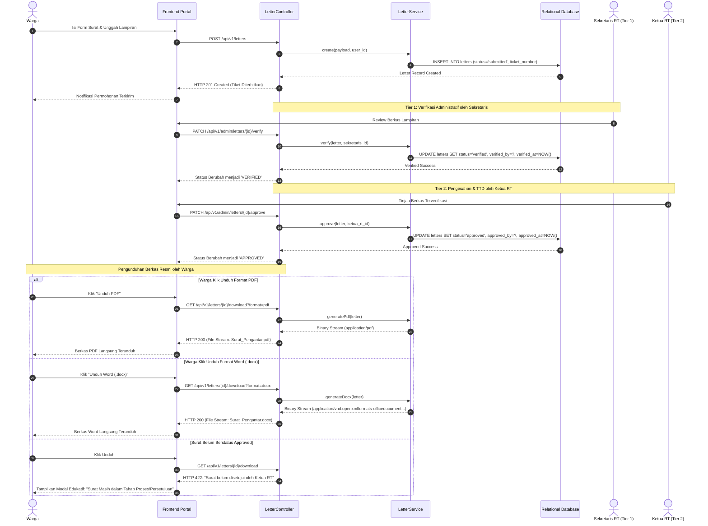

#### 5.3. UML State Machine Diagram

##### A. State Machine Permohonan Surat (Lifecycle Status Surat)
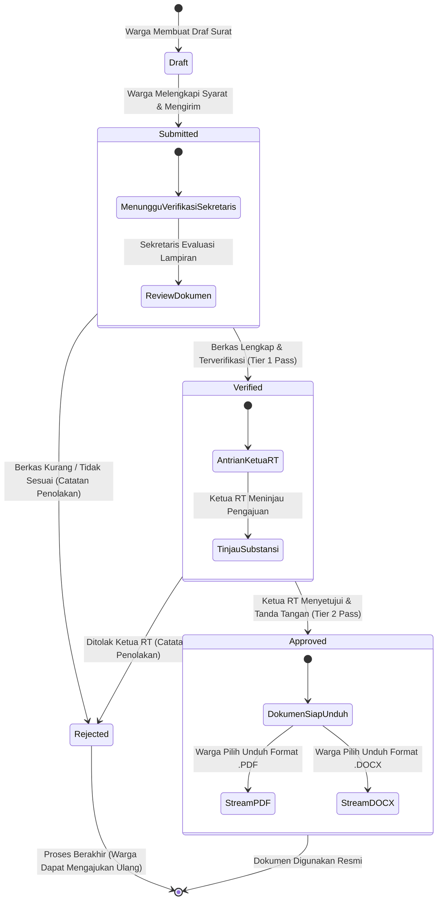

##### B. State Machine Status Kependudukan & Akun Warga
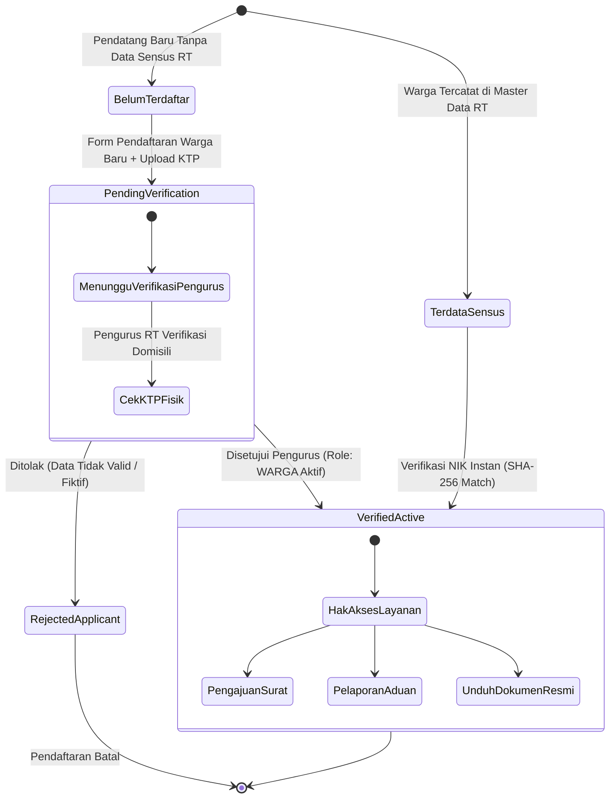

---

### 6. Flowchart Algoritma Sistem

#### A. Algoritma Verifikasi Hashing NIK (Proteksi Privasi Warga)
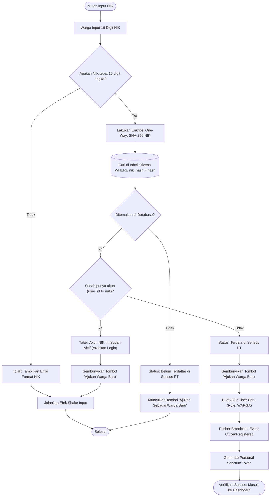

#### B. Algoritma Optimistic Locking & Audit Trail Pembukuan Kas RT
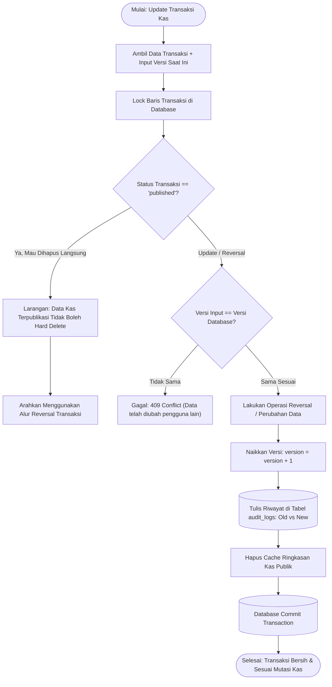

---

## Fitur Unggulan Antarmuka & Performa Web

### 1. Carousel Warta & Agenda Warga
- Menampilkan warta, agenda kegiatan warga, dan informasi penting lingkungan secara dinamis dan berputar otomatis.
- Dilengkapi teks penjelasan lengkap, badge kategori, jadwal, penunjuk lokasi, dan tombol aksi terarah.
- Didukung kontrol interaktif: tombol navigasi sebelumnya/selanjutnya, indikator titik slide, indikator jumlah informasi, swipe gesture pada layar sentuh mobile, dan jeda otomatis saat kursor mouse melintas (*pause on hover*).

### 2. Navbar 3 Menu Prioritas & Hamburger Drawer
- **Desktop Viewport:** Memprioritaskan 3 tautan menu paling krusial:
  1. `Warta & Agenda`: Navigasi cepat ke warta dan pengumuman terbaru.
  2. `Kas RT`: Menuju ringkasan transparansi keuangan lingkungan.
  3. `Lapor Pengaduan`: Tombol aksi cepat untuk membuka modal pengaduan warga.
  Ditambah tombol otentikasi `Masuk Portal` atau `Dashboard Warga`.
- **Hamburger Drawer (Off-Canvas):** Seluruh tautan sekunder (Agenda Kegiatan, Jadwal Ronda Kamling, Kontak Darurat 24 Jam, Struktur Pengurus RT, dan Swagger OpenAPI Spec) tertata rapi di dalam drawer geser dengan latar belakang blur dan dukungan tombol keyboard `Escape`.

### 3. Optimasi Core Web Vitals, LCP & CLS/LFS
- **Priority Hints:** Logo utama dimuat dengan `<link rel="preload" as="image" fetchpriority="high">` untuk mempercepat Largest Contentful Paint (LCP).
- **Zero Cumulative Layout Shift (CLS = 0):** Seluruh aset gambar (logo horizontal, simbol, favicon) memiliki atribut eksplisit `width` dan `height` serta `decoding="async"`.
- **Preconnect Font:** Koneksi awal asinkron ke server tipografi Google Fonts via Bunny Fonts untuk menghilangkan FOIT (*Flash of Invisible Text*).
- **GPU Accelerated Transitions:** Animasi slider carousel menggunakan properti CSS `transform: translate3d(...)` dan `will-change: transform` guna memastikan render 60 FPS tanpa Layout Shift Frequency (LFS).

### 4. Metadata SEO & Geolocation (GEO)
- **Search Engine Optimization:** Tag meta lengkap meliputi canonical URL, OpenGraph, Twitter Cards, dan meta robot (`index, follow, max-image-preview:large`).
- **Geolocation Indexing:** Menetapkan metadata geografis wilayah RT/RW (`geo.region`, `geo.placename`, `geo.position`, dan `ICBM`).
- **Structured Data (Schema.org JSON-LD):** Entitas `GovernmentOrganization` dan `WebSite` dengan koordinat lintang/bujur dan fungsionalitas pencarian pelacakan tiket surat terintegrasi.

---

## Persiapan Integrasi Firebase Versi Gratis (Spark Plan)

Proyek ini telah dikonfigurasi agar dapat berjalan secara optimal menggunakan **Firebase Spark Plan (Paket Gratis $0/bulan)**:

1. **Firebase Cloud Messaging (FCM) - 100% Gratis Tanpa Batas**:
   - Pengiriman Web Push Notifications status persuratan dan pengumuman darurat warga tanpa batasan kuota.
   - Didukung berkas Service Worker khusus: `public/firebase-messaging-sw.js` dan inisialisasi klien `public/js/firebase-init.js`.
2. **Cloud Firestore (1 GB Free / 50k Reads / 20k Writes per hari)**:
   - Sinkronisasi real-time warta dan pendaftaran token perangkat warga.
   - Aturan keamanan terperinci pada `firestore.rules` dan indeks kueri pada `firestore.indexes.json`.
3. **Cloud Storage (5 GB Free Storage)**:
   - Penyimpanan berkas lampiran surat dan bukti foto aduan warga dengan pembatasan ukuran maksimal 5 MB pada `storage.rules`.
4. **Firebase Hosting (10 GB Free Storage & CDN Global)**:
   - Konfigurasi caching aset statis 1 tahun dan rewrite PWA pada `firebase.json`.
5. **Panduan Lengkap**: Lihat panduan implementasi detail pada [docs/FIREBASE_FREE_TIER_SETUP.md](docs/FIREBASE_FREE_TIER_SETUP.md).

---

## Panduan Instalasi & Menjalankan Proyek

### 1. Kebutuhan Sistem (*Prerequisites*)
- **PHP** versi **>= 8.2** (Disarankan PHP 8.4)
- **Composer** versi **>= 2.5**
- **Node.js** versi **>= 18** & **NPM**
- **MySQL Database Server** (XAMPP / Laragon / Standalone MySQL)

### 2. Langkah Instalasi Langkah demi Langkah

1. **Clone Repositori**:
   ```bash
   git clone https://github.com/not162/platform-layanan-publik-warga.git
   cd platform-layanan-publik-warga
   ```

2. **Instal Dependensi Backend (PHP / Composer)**:
   ```bash
   composer install
   ```

3. **Instal Dependensi Frontend (Node.js / NPM)**:
   ```bash
   npm install
   ```

4. **Konfigurasi Lingkungan (`.env`)**:
   Salin file konfigurasi contoh:
   ```bash
   cp .env.example .env
   ```
   Buka file `.env` dan sesuaikan koneksi database MySQL:
   ```env
   DB_CONNECTION=mysql
   DB_HOST=127.0.0.1
   DB_PORT=3306
   DB_DATABASE=layanan_publik_warga
   DB_USERNAME=root
   DB_PASSWORD=
   ```

5. **Generate Kunci Aplikasi**:
   ```bash
   php artisan key:generate
   ```

6. **Migrasi Database & Seeder Kredensial Pengurus**:
   ```bash
   php artisan migrate --seed
   ```
   *Perintah ini akan membuat seluruh tabel di MySQL dan langsung mengisi akun **Superadmin**, **Ketua RT**, **Sekretaris**, **Bendahara**, master jenis surat, dan data sensus warga awal.*

7. **Kompilasi Aset Frontend (Vite & Tailwind CSS)**:
   ```bash
   # Untuk produksi:
   npm run build

   # Atau untuk mode pengembangan (hot-reload):
   npm run dev
   ```

8. **Jalankan Server Lokal**:
   ```bash
   php artisan serve
   ```
   Buka portal di browser Anda: **`http://127.0.0.1:8000`**

---

## Pengujian (Automated Testing)

Aplikasi memiliki rangkaian pengujian unit dan fitur (*Feature Tests*) dengan cakupan menyeluruh untuk menjamin keandalan sistem dan RBAC matrix:

```bash
# Menjalankan seluruh pengujian:
php artisan test
```

### Hasil Ringkasan Pengujian Otomatis:
```text
PASS  Tests\Feature\ArchitectureAndRbacNormalizationTest
PASS  Tests\Feature\CitizenModuleTest
PASS  Tests\Feature\CitizenServiceRoleMatrixTest
PASS  Tests\Feature\ComplaintCameraPermissionTest
PASS  Tests\Feature\ComplaintModuleTest
PASS  Tests\Feature\DocumentWorkflowAndGenerationTest
PASS  Tests\Feature\ExampleTest
PASS  Tests\Feature\FinanceLedgerSprint2Test
PASS  Tests\Feature\FinanceModuleTest
PASS  Tests\Feature\FinanceReportBackupTest
PASS  Tests\Feature\KepengurusanLoginTest
PASS  Tests\Feature\LetterModuleTest
PASS  Tests\Feature\NotificationModuleTest
PASS  Tests\Feature\PublicContentModuleTest
PASS  Tests\Feature\PurchaseAndQuarterlyReportSprint4Test
PASS  Tests\Feature\PwaModuleTest
PASS  Tests\Feature\ResidentDuePersonalLedgerSprint3Test
PASS  Tests\Feature\RoleAndAuthorizationTest
PASS  Tests\Feature\SecurityReportModuleTest

Tests:    128 passed (545 assertions)
Duration: 10.20s
Status:   100% OK
```

---

## Klasifikasi Dokumentasi Teknis (`docs/`)

Seluruh dokumentasi arsitektur, spesifikasi API, kebutuhan bisnis, perencanaan proyek, dan tata kelola sistem telah dikelompokkan ke dalam 5 subdirektori tematik di [docs/](docs/README.md):

### 1. Desain & Arsitektur Visual ([docs/design/](docs/design/))
- **[Brand Guide & Identitas Visual](docs/design/BRAND_GUIDE.md)**: Standardisasi warna, tipografi, dan logo lingkungan RT.
- **[Diagram Arsitektur Sistem](docs/design/DIAGRAMS.md)**: Relasi antarkomponen platform warga dan kepengurusan.
- **[Entity Relationship Diagram (ERD)](docs/design/ERD.md)**: Skema database relasional kependudukan, surat, dan kas warga.
- **[Perencanaan Antarmuka UI](docs/design/UI_PLAN.md)**: Tata letak antarmuka responsif ramah segala kalangan.
- **[Optimasi Performa Web & SEO](docs/design/WEB_PERFORMANCE_SEO_GEO.md)**: Strategi Core Web Vitals, priority hints, dan Schema.org Geolocation.

### 2. Spesifikasi API ([docs/api_spec/](docs/api_spec/))
- **[Spesifikasi API v1 Lengkap](docs/api_spec/API_SPEC.md)**: Rincian RESTful endpoints, parameter, headers, payload, dan responses.
- **[Kontrak API v1.1](docs/api_spec/API_V1_1_CONTRACT.md)**: Spesifikasi mutasi penagihan iuran warga dan audit transaksi.
- **[Skema Standar OpenAPI 3.1](docs/api_spec/openapi.yaml)**: Definisi API untuk Swagger UI interaktif yang dapat diakses di rute `/docs/api`.

### 3. Persyaratan Bisnis & Regulasi ([docs/business/](docs/business/))
- **[Software Requirements Specification (SRS)](docs/business/SRS.md)**: Kebutuhan fungsional dan non-fungsional aplikasi layanan warga.
- **[Klasifikasi & Enkripsi Data Warga](docs/business/DATA_CLASSIFICATION.md)**: Enkripsi NIK dua arah (AES-256-CBC) dan proteksi data PII.
- **[Alur Kerja & State Machine Surat](docs/business/LETTER_WORKFLOW.md)**: Alur penerbitan surat pengantar, verifikasi pengurus, penomoran urut bebas bentrok, dan tanda tangan elektronik.
- **[Regulasi Laporan Keuangan & Backup](docs/business/FINANCIAL_REPORTS_AND_BACKUP_STORE.md)**: Pembatasan unduh rekapitulasi khusus kepengurusan, audit jejak unduh, dan backup terenkripsi.
- **[Standardisasi Format Dokumen](docs/business/DOCUMENT_TEMPLATE.md)**: Template cetak dokumen resmi RT dan parameter dinamis.
- **[Analisis Performa Memori & Storage](docs/business/STORAGE_MEMORY_PERFORMANCE_ANALYSIS.md)**: Efisiensi penyimpanan berkas dan kompresi lampiran.

### 4. Perencanaan Proyek ([docs/plan_project/](docs/plan_project/))
- **[Master Project Plan](docs/plan_project/PROJECT_PLAN.md)**: Rencana strategis implementasi menyeluruh.
- **[Sprint Plan Roadmap](docs/plan_project/SPRINT_PLAN.md)**: Rincian 10 Sprint pengembangan berkelanjutan.

### 5. Tata Kelola & Infrastruktur ([docs/project_management/](docs/project_management/))
- **[Role-Based Access Control (RBAC)](docs/project_management/RBAC.md)**: Penegakan wewenang berprinsip Least Privilege untuk setiap role.
- **[Matriks Hak Akses Granular](docs/project_management/RBAC_MATRIX.md)**: Pemetaan permission granular per entitas modul.
- **[Panduan Integrasi Firebase Versi Gratis](docs/project_management/FIREBASE_FREE_TIER_SETUP.md)**: Pemanfaatan Firebase Spark Plan $0/bulan untuk notifikasi FCM, Storage, dan Firestore.
- **[Arsitektur Enterprise & Client Offloading](docs/project_management/MICROSERVICES_ENTERPRISE_ARCHITECTURE.md)**: Penanganan rendering PDF/Word di sisi front-end guna efisiensi CPU server.

---

## Lisensi
Proyek ini dikembangkan di bawah lisensi [MIT License](LICENSE). Hak Cipta &copy; 2026 Pengurus Lingkungan RT & Pengembang Sistem.
