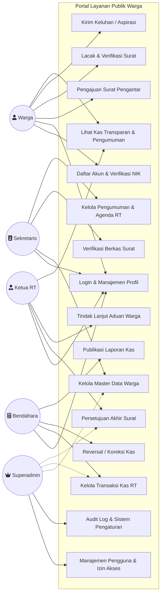
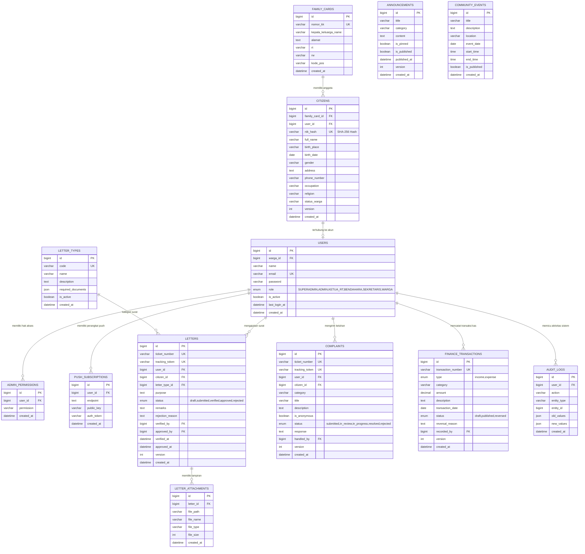
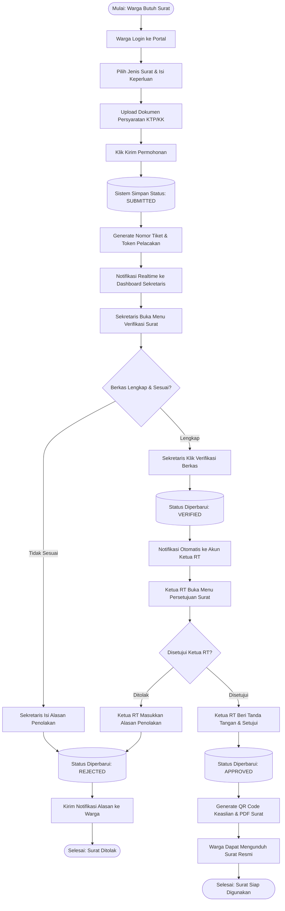
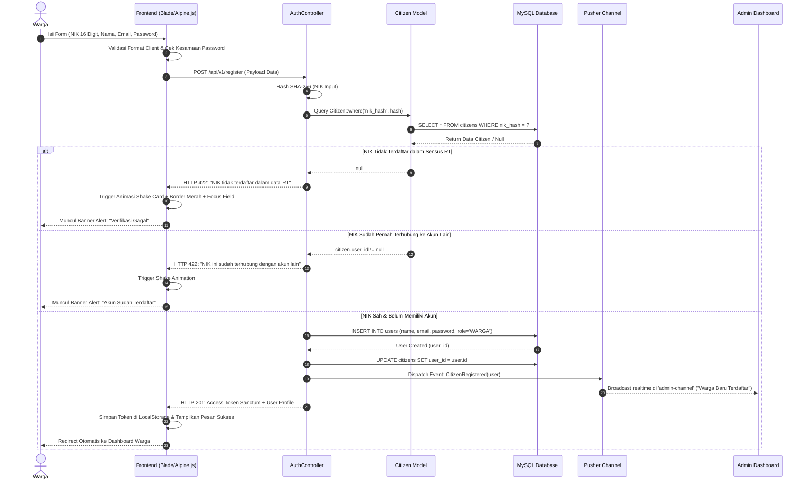
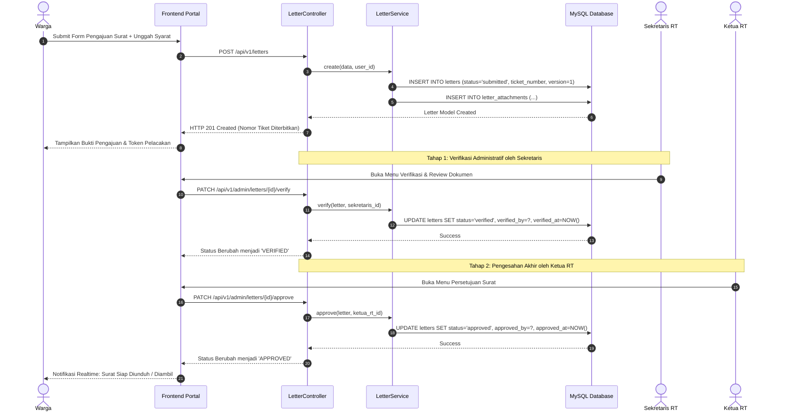
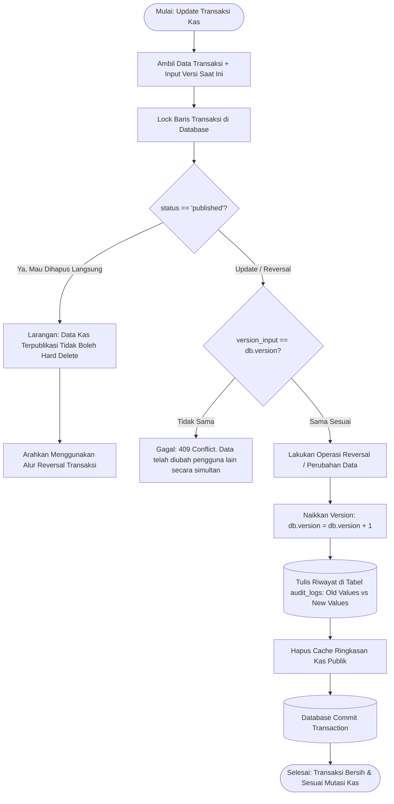

# 🏛️ Platform Layanan Publik Warga (Portal Digital RT/RW)

> Sistem Informasi Manajemen Administrasi, Pelayanan Surat Terpadu, Transparansi Kas Keuangan, dan Pengaduan Warga Berbasis Web & Progressive Web App (PWA).

---

## 📋 Daftar Isi
1. [Tentang Proyek](#-tentang-proyek)
2. [Tech Stack & Database](#-tech-stack--database)
3. [Daftar Akun & Kredensial Pengurus](#-daftar-akun--kredensial-pengurus)
4. [Arsitektur & Visualisasi Diagram](#-arsitektur--visualisasi-diagram)
   - [Use Case Diagram](#1-use-case-diagram)
   - [Entity Relationship Diagram (ERD)](#2-entity-relationship-diagram-erd)
   - [Logical Record Structure (LRS)](#3-logical-record-structure-lrs)
   - [Activity Diagram](#4-activity-diagram)
   - [Sequence Diagram](#5-sequence-diagram)
   - [Flowchart Algoritma Sistem](#6-flowchart-algoritma-sistem)
5. [Panduan Instalasi & Menjalankan Proyek](#-panduan-instalasi--menjalankan-proyek)
6. [Pengujian (Automated Testing)](#-pengujian-automated-testing)

---

## 📖 Tentang Proyek

**Platform Layanan Publik Warga** dirancang untuk mendigitalkan birokrasi di tingkat RT/RW secara terstruktur, transparan, dan aman. Platform ini memiliki fitur-fitur unggulan:
- **Verifikasi Warga Instan**: Pencocokan NIK berbasis satu arah (*One-Way Hashing SHA-256*) yang melindungi privasi NIK warga dari kebocoran data.
- **Birokrasi Surat Digital 2-Tier**: Verifikasi berkas administratif oleh **Sekretaris**, dilanjutkan dengan persetujuan/tanda tangan digital oleh **Ketua RT**.
- **Buku Kas Anti-Fraud (*Immutable Ledger*)**: Setiap transaksi kas yang telah dipublikasikan tidak dapat diubah atau dihapus sembarangan, melainkan harus melalui proses pembalik (*reversal ledger*) yang tercatat di audit log.
- **Real-Time Notification**: Terintegrasi dengan **Pusher Channels** dan **Web Push Notifications (PWA)** sehingga warga dan pengurus menerima notifikasi langsung di perangkat masing-masing.
- **Tampilan Ramah Pengguna**: Mengusung *Clean Light Theme Only*, tipografi Google Fonts Inter, ikonografi Lucide, dan interaktivitas Alpine.js dengan umpan balik animasi (efek *shake* kartu dan pesan validasi visual).

---

## 🛠️ Tech Stack & Database

| Komponen | Teknologi | Keterangan |
|---|---|---|
| **Backend Framework** | **Laravel 11 / 12 / 13** (PHP 8.4) | Arsitektur MVC, RESTful API Resource, Service Layer, Sanctum Auth |
| **Database Produksi** | **MySQL / MariaDB via phpMyAdmin** | Relasi antar tabel dengan Foreign Key Constraints & Indexing |
| **Database Development/Testing**| **SQLite (In-Memory / File)** | Digunakan untuk eksekusi Feature Testing dan CI/CD cepat |
| **Frontend Styling** | **Tailwind CSS v4** | Desain responsif modern berorientasi Light Mode elegan |
| **Frontend Interactivity** | **Alpine.js v3** | Reactive client-side validation, NIK counter, password toggle, animasi *shake* |
| **Ikonografi & Font** | **Lucide Icons & Google Fonts (Inter)** | Tampilan bersih, profesional, dan mudah dibaca oleh semua usia warga |
| **Real-time Broadcasting** | **Pusher Channels & Laravel Echo** | Siaran instan saat ada warga baru mendaftar atau status surat diperbarui |
| **Mobile & Offline Support** | **Progressive Web App (PWA)** | Service Worker Cache-First, Web App Manifest, Fallback Halaman Offline |
| **Code Formatter & QA** | **Laravel Pint & PHPUnit** | Standardisasi PSR-12 dan 53 Automated Feature Tests (100% Passed) |

### Konfigurasi Koneksi Database (MySQL / phpMyAdmin)
Untuk menghubungkan aplikasi ke MySQL via **phpMyAdmin / XAMPP**:
```env
DB_CONNECTION=mysql
DB_HOST=127.0.0.1
DB_PORT=3306
DB_DATABASE=layanan_publik_warga
DB_USERNAME=root
DB_PASSWORD=
```

---

## 👥 Daftar Akun & Kredensial Pengurus

Sistem telah dilengkapi data awal pengurus RT (**Seeders**) yang siap digunakan untuk login tanpa perlu membuat akun tiruan (*dummy*):

| Role Pengguna | Kategori | Email Login | Password Default | Wewenang & Hak Akses Fitur |
|---|---|---|---|---|
| **SUPERADMIN** | Sistem Administrator | `superadmin@warga.local` | `password` | **Akses Penuh Tanpa Batas**:<br>• Manajemen sistem, permission, role user.<br>• Akses semua modul data warga, surat, keuangan, dan audit trail. |
| **KETUA_RT** | Pengurus Inti | `ketua_rt@warga.local` | `password` | **Persetujuan Akhir & Supervisi**:<br>• Pengesahan/Persetujuan akhir Surat Pengantar (`letter.approve`).<br>• Monitoring transparansi kas & tindak lanjut aduan warga.<br>• Supervisi kependudukan lingkungan RT. |
| **SEKRETARIS** | Pengurus Administrasi | `sekretaris@warga.local` | `password` | **Administrasi & Pengumuman**:<br>• Verifikasi kelengkapan berkas surat warga (`letter.verify`).<br>• Pengelolaan master data kependudukan RT (`citizens.manage`).<br>• Buat, edit, dan publikasi agenda pengumuman (`announcements.manage`). |
| **BENDAHARA** | Pengurus Keuangan | `bendahara@warga.local` | `password` | **Tata Kelola Keuangan Kas** (`finance.manage`):<br>• Pencatatan kas masuk (iuran warga) & kas keluar.<br>• Publikasi laporan transparansi kas ke portal publik.<br>• Reversal audit transaksi kas jika ada koreksi data. |
| **WARGA** | Pengguna Publik | *(Sesuai registrasi warga)* | *(Ditentukan warga)* | **Layanan Mandiri Warga**:<br>• Mengajukan surat pengantar mandiri.<br>• Tracking status surat & verifikasi keaslian surat via token.<br>• Mengirimkan aduan/keluhan (bisa anonim).<br>• Melihat laporan transparansi kas & pengumuman RT. |

---

## 📊 Arsitektur & Visualisasi Diagram

### 1. Use Case Diagram
Diagram use case memetakan interaksi seluruh aktor (Warga, Sekretaris, Bendahara, Ketua RT, dan Superadmin) dengan fitur sistem.



---

### 2. Entity Relationship Diagram (ERD)
Diagram relasi entitas basis data MySQL yang memperlihatkan struktur tabel, tipe data, serta kardinalitas relasi (*one-to-one*, *one-to-many*).



---

### 3. Logical Record Structure (LRS)
Representasi relasional tabel skema database dengan relasi kunci utama (*Primary Key*) dan kunci tamu (*Foreign Key*):

```
┌──────────────────────────────────────────────┐
│                 FAMILY_CARDS                 │
├──────────────────────────────────────────────┤
│ PK  id                                       │
│     nomor_kk (Unique)                        │
│     kepala_keluarga_name, alamat, rt, rw     │
└──────────────────────┬───────────────────────┘
                       │ 1:N
┌──────────────────────▼───────────────────────┐          1:1          ┌──────────────────────────────────────────────┐
│                   CITIZENS                   ├───────────────────────►│                    USERS                     │
├──────────────────────────────────────────────┤                       ├──────────────────────────────────────────────┤
│ PK  id                                       │                       │ PK  id                                       │
│ FK  family_card_id                           │                       │ FK  warga_id ────────────────────────────────┤ (balik)
│ FK  user_id ─────────────────────────────────┼───────────────────────┤     name, email (Unique), password           │
│     nik_hash (Unique, SHA-256), full_name    │                       │     role (SUPERADMIN..WARGA), is_active      │
│     gender, address, phone_number, version   │                       └───────┬──────────────┬──────────────┬────────┘
└──────────────────────┬───────────────────────┘                               │ 1:N          │ 1:N          │ 1:N
                       │ 1:N                                                   │              │              │
                       ▼                                                       ▼              ▼              ▼
┌──────────────────────────────────────────────┐                       ┌──────────────┐┌──────────────┐┌──────────────┐
│                   LETTERS                    │                       │ADMIN_PERMISS ││AUDIT_LOGS    ││PUSH_SUBSCRIPT│
├──────────────────────────────────────────────┤                       ├──────────────┤├──────────────┤├──────────────┤
│ PK  id                                       │                       │PK id         ││PK id         ││PK id         │
│     ticket_number (Unique), tracking_token   │                       │FK user_id    ││FK user_id    ││FK user_id    │
│ FK  user_id                                  │                       │   permission ││   action...  ││   endpoint.. │
│ FK  citizen_id                               │                       └──────────────┘└──────────────┘└──────────────┘
│ FK  letter_type_id ────────┐                 │
│     status (submitted..approved), version    │                       ┌──────────────────────────────────────────────┐
│ FK  verified_by, FK approved_by              │                       │             FINANCE_TRANSACTIONS             │
└──────────────────────┬─────┴─────────────────┘                       ├──────────────────────────────────────────────┤
                       │ 1:N                                           │ PK  id                                       │
                       ▼                                               │     transaction_number (Unique)              │
┌──────────────────────────────────────────────┐                       │     type (income/expense), amount, status    │
│              LETTER_ATTACHMENTS              │                       │ FK  recorded_by (Users.id)                   │
├──────────────────────────────────────────────┤                       │     reversal_reason, version                 │
│ PK  id                                       │                       └──────────────────────────────────────────────┘
│ FK  letter_id                                │
│     file_path, file_name, file_size          │
└──────────────────────────────────────────────┘
```

---

### 4. Activity Diagram

#### A. Alur Pengajuan dan Persetujuan Surat Pengantar Warga


#### B. Alur Pencatatan & Pembatalan Transaksi Kas RT (Immutable Reversal)


---

### 5. Sequence Diagram

#### A. Registrasi Akun Warga & Verifikasi NIK Instan via Pusher


#### B. Pengajuan Surat Warga hingga Persetujuan Ketua RT


---

### 6. Flowchart Algoritma Sistem

#### A. Algoritma Verifikasi Hashing NIK (Proteksi Privasi Warga)
```mermaid
flowchart TD
    Start([Mulai: Input NIK]) --> In[Warga Input 16 Digit NIK]
    In --> V1{Apakah NIK tepat 16 digit angka?}
    V1 -- Tidak --> E1[Tolak: Tampilkan Error Format NIK]
    E1 --> Shake[Jalankan Efek Shake Input]
    Shake --> End1([Selesai])
    
    V1 -- Ya --> Hash[Lakukan Enkripsi One-Way: hash('sha256', NIK)]
    Hash --> Query[(Cari di tabel citizens WHERE nik_hash = hash)]
    Query --> Check{Ditemukan?}
    
    Check -- Tidak --> E2[Tolak: NIK Belum Terdaftar di Sensus RT]
    E2 --> Shake
    
    Check -- Ya --> Linked{user_id != null?}
    Linked -- Ya --> E3[Tolak: Akun NIK Ini Sudah Aktif]
    E3 --> Shake
    
    Linked -- Tidak --> Link[Hubungkan user_id ke baris citizen]
    Link --> Create[Buat Akun User Baru dengan Role: WARGA]
    Create --> Event[Pusher Broadcast: CitizenRegistered]
    Event --> Token[Generate Personal Sanctum Token]
    Token --> Sukses([Verifikasi Sukses: Masuk ke Dashboard])
```

#### B. Algoritma Optimistic Locking & Audit Trail Pembukuan Kas RT


---

## 🚀 Panduan Instalasi & Menjalankan Proyek

### 1. Kebutuhan Sistem (*Prerequisites*)
- **PHP** versi **>= 8.2** (Disarankan PHP 8.4)
- **Composer** versi **>= 2.5**
- **Node.js** versi **>= 18** & **NPM**
- **MySQL Database Server** (XAMPP / Laragon / Standalone MySQL)

### 2. Langkah Instalasi Langkah demi Langkah

1. **Clone Repositori**:
   ```bash
   git clone https://github.com/not162/platform-layanan-publik-warga.git
   cd platform-layanan-publik-warga
   ```

2. **Instal Dependensi Backend (PHP / Composer)**:
   ```bash
   composer install
   ```

3. **Instal Dependensi Frontend (Node.js / NPM)**:
   ```bash
   npm install
   ```

4. **Konfigurasi Lingkungan (`.env`)**:
   Salin file konfigurasi contoh:
   ```bash
   cp .env.example .env
   ```
   Buka file `.env` dan sesuaikan koneksi database MySQL:
   ```env
   DB_CONNECTION=mysql
   DB_HOST=127.0.0.1
   DB_PORT=3306
   DB_DATABASE=layanan_publik_warga
   DB_USERNAME=root
   DB_PASSWORD=
   ```

5. **Generate Kunci Aplikasi**:
   ```bash
   php artisan key:generate
   ```

6. **Migrasi Database & Seeder Kredensial Pengurus**:
   ```bash
   php artisan migrate --seed
   ```
   *Perintah ini akan membuat seluruh tabel di MySQL dan langsung mengisi akun **Superadmin**, **Ketua RT**, **Sekretaris**, **Bendahara**, master jenis surat, dan data sensus warga awal.*

7. **Kompilasi Aset Frontend (Vite & Tailwind CSS)**:
   ```bash
   # Untuk produksi:
   npm run build

   # Atau untuk mode pengembangan (hot-reload):
   npm run dev
   ```

8. **Jalankan Server Lokal**:
   ```bash
   php artisan serve
   ```
   Buka portal di browser Anda: **`http://127.0.0.1:8000`**

---

## 🧪 Pengujian (Automated Testing)

Aplikasi memiliki rangkaian pengujian unit dan fitur (*Feature Tests*) dengan cakupan menyeluruh untuk menjamin keandalan sistem:

```bash
# Menjalankan seluruh pengujian:
php artisan test
```

### Hasil Ringkasan Pengujian:
```text
PASS  Tests\Feature\CitizenModuleTest
PASS  Tests\Feature\ComplaintModuleTest
PASS  Tests\Feature\ExampleTest
PASS  Tests\Feature\FinanceModuleTest
PASS  Tests\Feature\LetterModuleTest
PASS  Tests\Feature\NotificationModuleTest
PASS  Tests\Feature\PublicContentModuleTest
PASS  Tests\Feature\PwaModuleTest
PASS  Tests\Feature\RoleAndAuthorizationTest

Tests:    53 passed (184 assertions)
Duration: 8.36s
Status:   100% OK
```

---

## 📄 Lisensi
Proyek ini dikembangkan di bawah lisensi [MIT License](LICENSE). Hak Cipta &copy; 2026 Pengurus Lingkungan RT & Pengembang Sistem.
