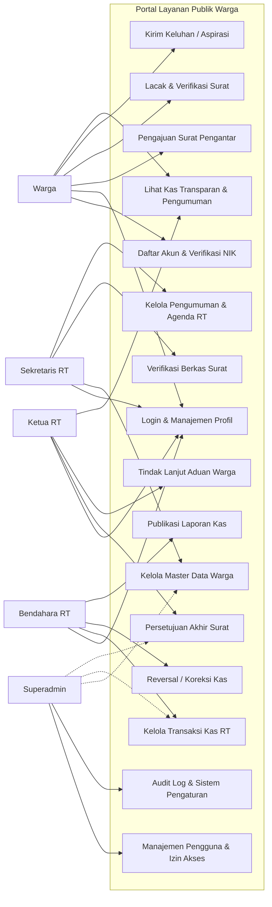
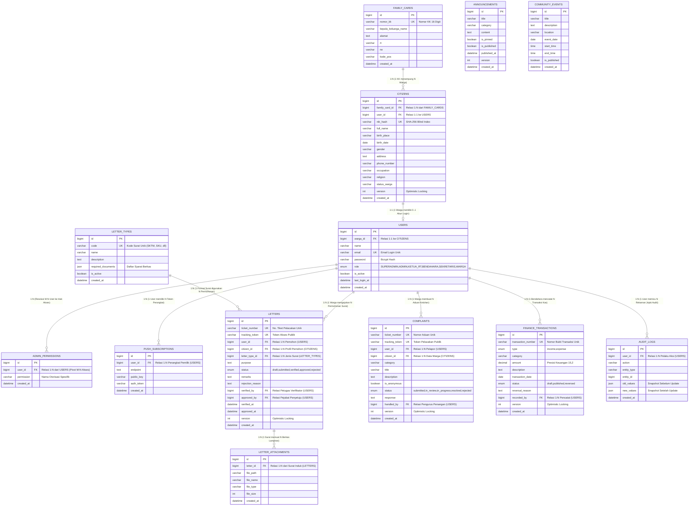
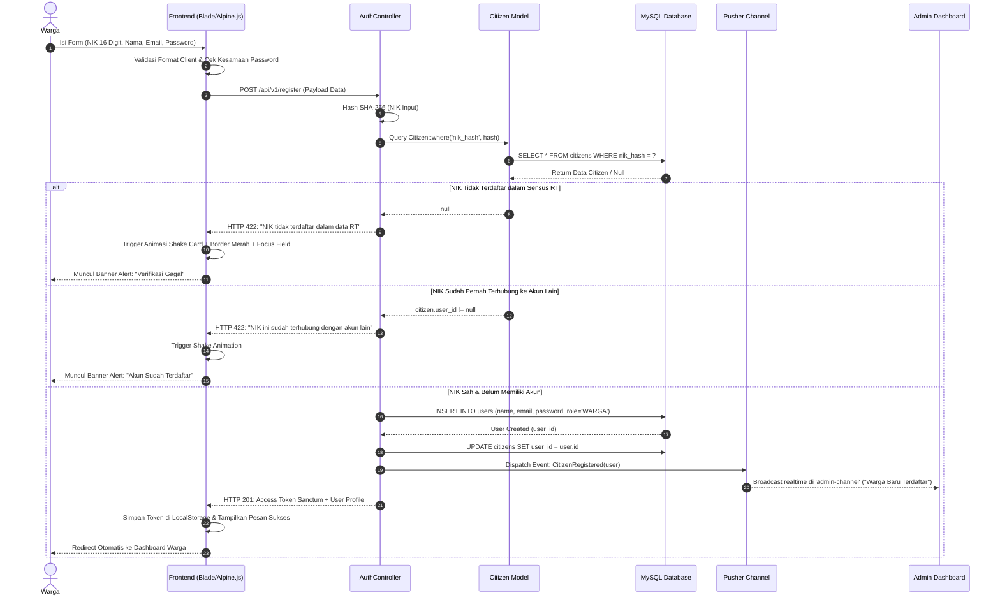
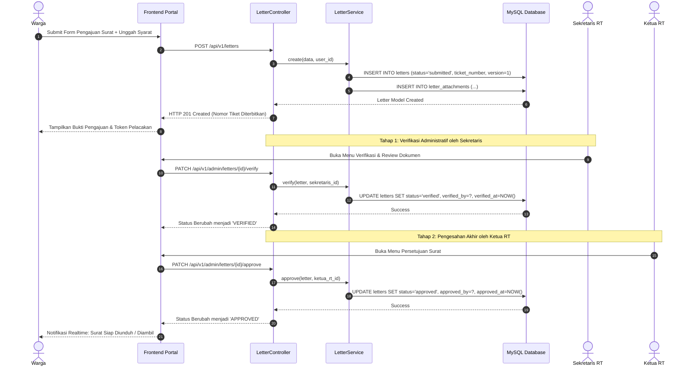
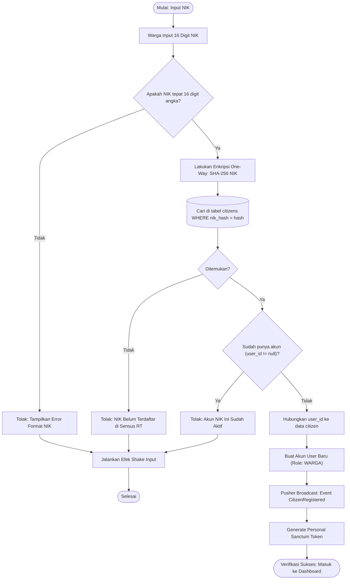

# Platform Layanan Publik Warga (Portal Digital RT/RW)

> Sistem Informasi Manajemen Administrasi, Pelayanan Surat Terpadu, Transparansi Kas Keuangan, dan Pengaduan Warga Berbasis Web & Progressive Web App (PWA).

---

## Daftar Isi
1. [Tentang Proyek](#tentang-proyek)
2. [Tech Stack & Database](#tech-stack--database)
3. [Daftar Akun & Kredensial Pengurus](#daftar-akun--kredensial-pengurus)
4. [Arsitektur & Visualisasi Diagram](#arsitektur--visualisasi-diagram)
   - [Use Case Diagram](#1-use-case-diagram)
   - [Entity Relationship Diagram (ERD)](#2-entity-relationship-diagram-erd)
   - [Logical Record Structure (LRS)](#3-logical-record-structure-lrs)
   - [Activity Diagram](#4-activity-diagram)
   - [Sequence Diagram](#5-sequence-diagram)
   - [Flowchart Algoritma Sistem](#6-flowchart-algoritma-sistem)
5. [Fitur Unggulan Antarmuka & Performa Web](#fitur-unggulan-antarmuka--performa-web)
   - [Carousel Warta & Agenda Warga](#1-carousel-warta--agenda-warga)
   - [Navbar 3 Menu Prioritas & Hamburger Drawer](#2-navbar-3-menu-prioritas--hamburger-drawer)
   - [Optimasi Core Web Vitals, LCP & CLS/LFS](#3-optimasi-core-web-vitals-lcp--clslfs)
   - [Metadata SEO & Geolocation (GEO)](#4-metadata-seo--geolocation-geo)
6. [Persiapan Integrasi Firebase Versi Gratis (Spark Plan)](#persiapan-integrasi-firebase-versi-gratis-spark-plan)
7. [Panduan Instalasi & Menjalankan Proyek](#panduan-instalasi--menjalankan-proyek)
8. [Pengujian (Automated Testing)](#pengujian-automated-testing)
9. [Dokumentasi Teknis & Spesifikasi API](#dokumentasi-teknis--spesifikasi-api)

---

## Tentang Proyek

**Platform Layanan Publik Warga** dirancang untuk mendigitalkan birokrasi di tingkat RT/RW secara terstruktur, transparan, dan aman. Platform ini memiliki fitur-fitur unggulan:
- **Verifikasi Warga Instan**: Pencocokan NIK berbasis satu arah (*One-Way Hashing SHA-256*) yang melindungi privasi NIK warga dari kebocoran data.
- **Birokrasi Surat Digital 2-Tier**: Verifikasi berkas administratif oleh **Sekretaris**, dilanjutkan dengan persetujuan/tanda tangan digital oleh **Ketua RT**.
- **Buku Kas Anti-Fraud (*Immutable Ledger*)**: Setiap transaksi kas yang telah dipublikasikan tidak dapat diubah atau dihapus sembarangan, melainkan harus melalui proses pembalik (*reversal ledger*) yang tercatat di audit log.
- **Real-Time Notification**: Terintegrasi dengan **Pusher Channels** dan **Web Push Notifications (PWA)** sehingga warga dan pengurus menerima notifikasi langsung di perangkat masing-masing.
- **Tampilan Ramah Pengguna**: Mengusung *Clean Light Theme Only*, tipografi Google Fonts Inter, ikonografi Lucide, dan interaktivitas Alpine.js dengan umpan balik animasi (efek *shake* kartu dan pesan validasi visual).

---

## Tech Stack & Database

| Komponen | Teknologi | Keterangan |
|---|---|---|
| **Backend Framework** | **Laravel 11 / 12 / 13** (PHP 8.4) | Arsitektur MVC, RESTful API Resource, Service Layer, Sanctum Auth |
| **Database Produksi** | **MySQL / MariaDB via phpMyAdmin** | Relasi antar tabel dengan Foreign Key Constraints & Indexing |
| **Database Development/Testing**| **SQLite (In-Memory / File)** | Digunakan untuk eksekusi Feature Testing dan CI/CD cepat |
| **Frontend Styling** | **Tailwind CSS v4** | Desain responsif modern berorientasi Light Mode elegan |
| **Frontend Interactivity** | **Alpine.js v3** | Reactive client-side validation, NIK counter, password toggle, animasi *shake* |
| **Ikonografi & Font** | **Lucide Icons & Google Fonts (Inter)** | Tampilan bersih, profesional, dan mudah dibaca oleh semua usia warga |
| **Real-time Broadcasting** | **Pusher Channels & Laravel Echo** | Siaran instan saat ada warga baru mendaftar atau status surat diperbarui |
| **Mobile & Offline Support** | **Progressive Web App (PWA)** | Service Worker Cache-First, Web App Manifest, Fallback Halaman Offline |
| **Code Formatter & QA** | **Laravel Pint & PHPUnit** | Standardisasi PSR-12 dan 53 Automated Feature Tests (100% Passed) |

### Konfigurasi Koneksi Database (MySQL / phpMyAdmin)
Untuk menghubungkan aplikasi ke MySQL via **phpMyAdmin / XAMPP**:
```env
DB_CONNECTION=mysql
DB_HOST=127.0.0.1
DB_PORT=3306
DB_DATABASE=layanan_publik_warga
DB_USERNAME=root
DB_PASSWORD=
```

---

## Daftar Akun & Kredensial Pengurus

Sistem telah dilengkapi data awal pengurus RT (**Seeders**) yang siap digunakan untuk login tanpa perlu membuat akun tiruan (*dummy*):

| Role Pengguna | Kategori | Email Login | Password Default | Wewenang & Hak Akses Fitur |
|---|---|---|---|---|
| **SUPERADMIN** | Sistem Administrator | `superadmin@warga.local` | `password` | **Akses Penuh Tanpa Batas**:<br>• Manajemen sistem, permission, role user.<br>• Akses semua modul data warga, surat, keuangan, subfolder laporan, dan audit trail. |
| **KETUA_RT** | Pengurus Inti | `ketua_rt@warga.local` | `password` | **Persetujuan Akhir & Supervisi**:<br>• Pengesahan/Persetujuan akhir Surat Pengantar (`letter.approve`).<br>• Monitoring transparansi kas, tinjau laporan keuangan RT, & tindak lanjut aduan warga.<br>• Supervisi kependudukan lingkungan RT. |
| **SEKRETARIS** | Pengurus Administrasi | `sekretaris@warga.local` | `password` | **Administrasi, Pengumuman & Akses Laporan Kas**:<br>• Verifikasi kelengkapan berkas surat warga (`letter.verify`).<br>• Pengelolaan master data kependudukan RT (`citizen.manage`).<br>• Template surat (`letter.template.manage`) & Agenda Pengumuman (`announcement.manage`).<br>• Akses unduh Laporan Kas RT Bulanan & Rekapitulasi Kas Pembayaran Iuran Warga dari subfolder privat. |
| **BENDAHARA** | Pengurus Keuangan | `bendahara@warga.local` | `password` | **Tata Kelola Keuangan Kas & Backup Store** (`finance.manage`, `finance.report`):<br>• Pencatatan kas masuk (iuran warga) & kas keluar.<br>• Unduh Laporan Kas RT Bulanan (.HTML / .CSV) & Kas Pembayaran Iuran Warga Per Bulan dari subfolder privat `storage/app/private/financial-reports/`.<br>• Jalankan snapshot *Immutable Backup Store* data keuangan terenkripsi dengan verifikasi *Checksum SHA-256*.<br>• Reversal audit transaksi kas jika ada koreksi data. |
| **PETUGAS_KEAMANAN** | Keamanan Lingkungan | `keamanan@warga.local` | `password` | **Pengelolaan Keamanan & Ketertiban** (`security.manage`):<br>• Manajemen & penugasan laporan insiden keamanan (`security_reports`).<br>• Investigasi dan resolusi tiket keamanan warga.<br>• Pengelolaan jadwal ronda lingkungan & kontak darurat. |
| **WARGA** | Pengguna Publik | *(Sesuai registrasi warga)* | *(Ditentukan warga)* | **Layanan Mandiri Warga**:<br>• Mengajukan surat pengantar mandiri (`letter.create`).<br>• Tracking status surat & verifikasi keaslian surat via token.<br>• Mengirimkan aduan lingkungan lengkap dengan input rincian jalan & lokasi serta izin akses upload foto kamera (khusus akun warga terverifikasi).<br>• Melihat laporan transparansi kas & pengumuman RT. |

---

## Arsitektur & Visualisasi Diagram

### 1. Use Case Diagram
Diagram use case memetakan interaksi seluruh aktor (Warga, Sekretaris, Bendahara, Ketua RT, dan Superadmin) dengan fitur sistem.



---

### 2. Entity Relationship Diagram (ERD)
Diagram relasi entitas basis data MySQL yang memperlihatkan struktur tabel, tipe data, serta **kardinalitas relasi secara eksplisit (*One-to-One [1:1]*, *One-to-Many [1:N]*, dan resolusi *Many-to-Many [M:N]*)**.



#### Matriks Klasifikasi Kardinalitas Relasi (ERD)

| Entitas Asal (Parent) | Entitas Tujuan (Child) | Kardinalitas | Kunci Relasi (PK ➔ FK) | Penjelasan Logika Bisnis & Mekanisme Relasi |
| :--- | :--- | :---: | :--- | :--- |
| **`FAMILY_CARDS`** | **`CITIZENS`** | **`1 : N`** (One-to-Many) | `FAMILY_CARDS.id` ➔ `CITIZENS.family_card_id` | **Satu** Kartu Keluarga menaungi **banyak** anggota keluarga warga RT. Satu warga wajib terdaftar pada tepat satu KK. |
| **`CITIZENS`** | **`USERS`** | **`1 : 1`** (One-to-One) | `CITIZENS.user_id` ➔ `USERS.id`<br>`USERS.warga_id` ➔ `CITIZENS.id` | **Satu** data kependudukan warga memiliki tepat **satu** akun autentikasi portal (relasi bi-directional untuk integritas identitas). |
| **`USERS`** | **`ADMIN_PERMISSIONS`** | **`1 : N`** *(Pecahan M:N)* | `USERS.id` ➔ `ADMIN_PERMISSIONS.user_id` | **Satu** akun pengguna dapat memiliki **banyak** hak akses granular (*role-permission assignment*). |
| **`USERS`** <br>*(Konseptual)* | **`PERMISSIONS`** <br>*(Konseptual)* | **`M : N`** *(Many-to-Many)* | Diurai via Junction Table:<br>**`ADMIN_PERMISSIONS`** | **Banyak** User dapat memiliki **banyak** Permission yang sama. Relasi Many-to-Many dinormalisasi menjadi dua relasi One-to-Many (1:N) melalui tabel pivot `ADMIN_PERMISSIONS`. |
| **`LETTER_TYPES`** | **`LETTERS`** | **`1 : N`** (One-to-Many) | `LETTER_TYPES.id` ➔ `LETTERS.letter_type_id` | **Satu** jenis formulir surat (SKTM, SKU, dll.) digunakan sebagai template permohonan oleh **banyak** surat warga. |
| **`USERS`** | **`LETTERS`** | **`1 : N`** (One-to-Many) | `USERS.id` ➔ `LETTERS.user_id` | **Satu** akun warga dapat mengajukan **banyak** surat pengantar sepanjang waktu. |
| **`LETTERS`** | **`LETTER_ATTACHMENTS`**| **`1 : N`** (One-to-Many) | `LETTERS.id` ➔ `LETTER_ATTACHMENTS.letter_id` | **Satu** berkas surat permohonan dapat memiliki **banyak** lampiran dokumen pendukung (KTP, KK, Bukti Bayar, dll.). |
| **`USERS`** | **`COMPLAINTS`** | **`1 : N`** (One-to-Many) | `USERS.id` ➔ `COMPLAINTS.user_id` | **Satu** warga dapat menyampaikan **banyak** laporan keluhan aspirasi lingkungan RT. |
| **`USERS`** | **`FINANCE_TRANSACTIONS`** | **`1 : N`** (One-to-Many) | `USERS.id` ➔ `FINANCE_TRANSACTIONS.recorded_by` | **Satu** pengurus kas (Bendahara) dapat mencatat dan mengelola **banyak** mutasi kas masuk/keluar. |
| **`USERS`** | **`AUDIT_LOGS`** | **`1 : N`** (One-to-Many) | `USERS.id` ➔ `AUDIT_LOGS.user_id` | **Satu** pengguna dapat memicu **banyak** baris pencatatan jejak audit audit trail sistem. |
| **`USERS`** | **`PUSH_SUBSCRIPTIONS`**| **`1 : N`** (One-to-Many) | `USERS.id` ➔ `PUSH_SUBSCRIPTIONS.user_id` | **Satu** pengguna dapat mendaftarkan **banyak** token browser/perangkat mobile untuk WebPush Notification. |
| **`USERS` (Warga)** <br>*(Konseptual)* | **`USERS` (Pengurus)** <br>*(Konseptual)* | **`M : N`** *(Many-to-Many)* | Diurai via Associative Entity:<br>**`LETTERS`** & **`COMPLAINTS`** | **Banyak** warga dapat dilayani oleh **banyak** pengurus (Sekretaris & Ketua RT). Relasi M:N ini dihubungkan secara ternormalisasi melalui entitas transaksi `LETTERS` (`user_id`, `verified_by`, `approved_by`). |

---

### 3. Logical Record Structure (LRS)
Representasi relasional tabel skema database dengan relasi kunci utama (*Primary Key* / `PK`), kunci tamu (*Foreign Key* / `FK`), serta penanda kardinalitas relasi **`[1:1]`**, **`[1:N]`**, dan **`[M:N (Tabel Pivot/Perantara)]`**:

```
┌────────────────────────────────────────────────────────┐
│                      FAMILY_CARDS                      │
├────────────────────────────────────────────────────────┤
│ PK   id                                                │
│      nomor_kk (Unique, 16 Digit)                       │
│      kepala_keluarga_name, alamat, rt, rw, kode_pos    │
└───────────────────────────┬────────────────────────────┘
                            │
                            │ [1:N] (One-to-Many)
                            ▼
┌────────────────────────────────────────────────────────┐                [1:1] (One-to-One)               ┌────────────────────────────────────────────────────────┐
│                        CITIZENS                        ├────────────────────────────────────────────────►│                         USERS                          │
├────────────────────────────────────────────────────────┤                                                 ├────────────────────────────────────────────────────────┤
│ PK   id                                                │                                                 │ PK   id                                                │
│ FK   family_card_id ───────────────────────────────────┼── (Relasi 1:N dari FAMILY_CARDS)                │ FK   warga_id ─────────────────────────────────────────┤ (Relasi 1:1 ke CITIZENS)
│ FK   user_id ──────────────────────────────────────────┼── (Relasi 1:1 ke USERS)                         │      name, email (Unique), password (Bcrypt)           │
│      nik_hash (Unique, SHA-256), full_name             │                                                 │      role (SUPERADMIN, KETUA_RT, BENDAHARA, ..), active│
│      birth_place, birth_date, gender, address, phone   │                                                 └────────┬──────────────┬──────────────┬──────────────┬───┘
│      occupation, religion, status_warga, version       │                                                          │ [1:N]        │ [1:N]        │ [1:N]        │ [1:N]
└───────────────────────────┬────────────────────────────┘                                                          │              │              │              │
                            │ [1:N]                                                                                 ▼              ▼              ▼              │
                            ▼                                                                              ┌────────────────┐┌────────────┐┌─────────────┐       │
┌────────────────────────────────────────────────────────┐                                                 │ADMIN_PERMISSION││ AUDIT_LOGS ││PUSH_SUBSCRIP│       │
│                        LETTERS                         │                                                 ├────────────────┤├────────────┤├─────────────┤       │
├────────────────────────────────────────────────────────┤                                                 │PK  id          ││PK  id      ││PK  id       │       │
│ PK   id                                                │                                                 │FK  user_id     ││FK  user_id ││FK  user_id  │       │
│      ticket_number (Unique), tracking_token (Unique)   │                                                 │    permission  ││    action  ││    endpoint │       │
│ FK   user_id ──────────────────────────────────────────┼── (Relasi 1:N dari USERS Pemohon)               └────────────────┘└────────────┘└─────────────┘       │
│ FK   citizen_id ───────────────────────────────────────┼── (Relasi 1:N dari Profil CITIZENS)              [M:N Pivot Table]                                    │
│ FK   letter_type_id ◄──────────┐                       │                                                                                                       │
│      purpose, status (submitted..approved), version    │                                                 ┌──────────────────────────────────────────────┐      │
│ FK   verified_by (Users.id)    │ [1:N]                 │                                                 │             FINANCE_TRANSACTIONS             │◄─────┘
│ FK   approved_by (Users.id)    │                       │                                                 ├──────────────────────────────────────────────┤
└───────────────────────────┬────┴───────────────────────┘                                                 │ PK   id                                      │
                            │                                                                              │      transaction_number (Unique)             │
                            │ [1:N] (One-to-Many)                                                          │      type (income, expense), category, amount│
                            ▼                                                                              │      description, date, status, reversal     │
┌────────────────────────────────────────────────────────┐  ┌───────────────────────────────────────────┐  │ FK   recorded_by (Users.id) ─────────────────┼── (Relasi 1:N Pencatat)
│                   LETTER_ATTACHMENTS                   │  │               LETTER_TYPES                │  │      version (Optimistic Lock)               │
├────────────────────────────────────────────────────────┤  ├───────────────────────────────────────────┤  └──────────────────────────────────────────────┘
│ PK   id                                                │  │ PK   id                                   │
│ FK   letter_id ────────────────────────────────────────┤  │      code (Unique, SKTM/SKU), name, desc  │  ┌──────────────────────────────────────────────┐
│      file_path, file_name, file_type, file_size        │  │      required_documents (JSON), is_active │  │                  COMPLAINTS                  │
└────────────────────────────────────────────────────────┘  └─────────────────────┬─────────────────────┘  ├──────────────────────────────────────────────┤
                                                                                  │ [1:N]                  │ PK   id                                      │
                                                                                  └────────────────────────┤      ticket_number (Unique), tracking_token  │
                                                                                                           │ FK   user_id (Users.id) ─────────────────────┼── (Relasi 1:N Pembuat Aduan)
                                                                                                           │ FK   citizen_id (Citizens.id)                │
                                                                                                           │      category, title, description, status    │
                                                                                                           │ FK   handled_by (Users.id)                   │
                                                                                                           └──────────────────────────────────────────────┘
```

#### Notasi Relasional LRS (Relational Mapping Notation)
Menunjukkan struktur relasi antar tabel secara formal (`PK = Primary Key Garis Bawah`, `FK = Foreign Key Prefix #`):

1. **`FAMILY_CARDS`** (<u>id</u>, *nomor_kk*, kepala_keluarga_name, alamat, rt, rw, kode_pos, created_at)
2. **`CITIZENS`** (<u>id</u>, **#family_card_id** *(1:N)*, **#user_id** *(1:1)*, *nik_hash*, full_name, birth_place, birth_date, gender, address, phone_number, occupation, religion, status_warga, version, created_at)
3. **`USERS`** (<u>id</u>, **#warga_id** *(1:1)*, name, *email*, password, role, is_active, last_login_at, created_at)
4. **`ADMIN_PERMISSIONS`** (<u>id</u>, **#user_id** *(1:N / Resolusi M:N)*, permission, created_at)
   - *Mekanisme Normalisasi M:N:* Menguraikan relasi Many-to-Many antara kumpulan Pengguna (`USERS`) dan Hak Otorisasi (`PERMISSIONS`) menjadi tabel asosiatif independen.
5. **`LETTER_TYPES`** (<u>id</u>, *code*, name, description, required_documents, is_active, created_at)
6. **`LETTERS`** (<u>id</u>, *ticket_number*, *tracking_token*, **#user_id** *(1:N)*, **#citizen_id** *(1:N)*, **#letter_type_id** *(1:N)*, purpose, status, remarks, rejection_reason, **#verified_by** *(1:N)*, **#approved_by** *(1:N)*, verified_at, approved_at, version, created_at)
   - *Mekanisme Normalisasi M:N:* Menghubungkan relasi Many-to-Many antara Warga Pemohon dengan Multi-Pengurus Penyetuju (Sekretaris & Ketua RT) dalam alur verifikasi surat bertingkat.
7. **`LETTER_ATTACHMENTS`** (<u>id</u>, **#letter_id** *(1:N)*, file_path, file_name, file_type, file_size, created_at)
8. **`COMPLAINTS`** (<u>id</u>, *ticket_number*, *tracking_token*, **#user_id** *(1:N)*, **#citizen_id** *(1:N)*, category, title, description, is_anonymous, status, response, **#handled_by** *(1:N)*, version, created_at)
9. **`FINANCE_TRANSACTIONS`** (<u>id</u>, *transaction_number*, type, category, amount, description, transaction_date, status, reversal_reason, **#recorded_by** *(1:N)*, version, created_at)
10. **`AUDIT_LOGS`** (<u>id</u>, **#user_id** *(1:N)*, action, entity_type, entity_id, old_values, new_values, created_at)
11. **`PUSH_SUBSCRIPTIONS`** (<u>id</u>, **#user_id** *(1:N)*, endpoint, public_key, auth_token, created_at)
12. **`ANNOUNCEMENTS`** (<u>id</u>, title, category, content, is_pinned, is_published, published_at, version, created_at)
13. **`COMMUNITY_EVENTS`** (<u>id</u>, title, description, location, event_date, start_time, end_time, is_published, created_at)

---

### 4. Activity Diagram

#### A. Alur Pengajuan dan Persetujuan Surat Pengantar Warga


#### B. Alur Pencatatan & Pembatalan Transaksi Kas RT (Immutable Reversal)


---

### 5. Sequence Diagram

#### A. Registrasi Akun Warga & Verifikasi NIK Instan via Pusher


#### B. Pengajuan Surat Warga hingga Persetujuan Ketua RT


---

### 6. Flowchart Algoritma Sistem

#### A. Algoritma Verifikasi Hashing NIK (Proteksi Privasi Warga)


#### B. Algoritma Optimistic Locking & Audit Trail Pembukuan Kas RT


---

## Fitur Unggulan Antarmuka & Performa Web

### 1. Carousel Warta & Agenda Warga
- Menampilkan warta, agenda kegiatan warga, dan informasi penting lingkungan secara dinamis dan berputar otomatis.
- Dilengkapi teks penjelasan lengkap, badge kategori, jadwal, penunjuk lokasi, dan tombol aksi terarah.
- Didukung kontrol interaktif: tombol navigasi sebelumnya/selanjutnya, indikator titik slide, indikator jumlah informasi, swipe gesture pada layar sentuh mobile, dan jeda otomatis saat kursor mouse melintas (*pause on hover*).

### 2. Navbar 3 Menu Prioritas & Hamburger Drawer
- **Desktop Viewport:** Memprioritaskan 3 tautan menu paling krusial:
  1. `Warta & Agenda`: Navigasi cepat ke warta dan pengumuman terbaru.
  2. `Kas RT`: Menuju ringkasan transparansi keuangan lingkungan.
  3. `Lapor Pengaduan`: Tombol aksi cepat untuk membuka modal pengaduan warga.
  Ditambah tombol otentikasi `Masuk Portal` atau `Dashboard Warga`.
- **Hamburger Drawer (Off-Canvas):** Seluruh tautan sekunder (Agenda Kegiatan, Jadwal Ronda Kamling, Kontak Darurat 24 Jam, Struktur Pengurus RT, dan Swagger OpenAPI Spec) tertata rapi di dalam drawer geser dengan latar belakang blur dan dukungan tombol keyboard `Escape`.

### 3. Optimasi Core Web Vitals, LCP & CLS/LFS
- **Priority Hints:** Logo utama dimuat dengan `<link rel="preload" as="image" fetchpriority="high">` untuk mempercepat Largest Contentful Paint (LCP).
- **Zero Cumulative Layout Shift (CLS = 0):** Seluruh aset gambar (logo horizontal, simbol, favicon) memiliki atribut eksplisit `width` dan `height` serta `decoding="async"`.
- **Preconnect Font:** Koneksi awal asinkron ke server tipografi Google Fonts via Bunny Fonts untuk menghilangkan FOIT (*Flash of Invisible Text*).
- **GPU Accelerated Transitions:** Animasi slider carousel menggunakan properti CSS `transform: translate3d(...)` dan `will-change: transform` guna memastikan render 60 FPS tanpa Layout Shift Frequency (LFS).

### 4. Metadata SEO & Geolocation (GEO)
- **Search Engine Optimization:** Tag meta lengkap meliputi canonical URL, OpenGraph, Twitter Cards, dan meta robot (`index, follow, max-image-preview:large`).
- **Geolocation Indexing:** Menetapkan metadata geografis wilayah RT/RW (`geo.region`, `geo.placename`, `geo.position`, dan `ICBM`).
- **Structured Data (Schema.org JSON-LD):** Entitas `GovernmentOrganization` dan `WebSite` dengan koordinat lintang/bujur dan fungsionalitas pencarian pelacakan tiket surat terintegrasi.

---

## Persiapan Integrasi Firebase Versi Gratis (Spark Plan)

Proyek ini telah dikonfigurasi agar dapat berjalan secara optimal menggunakan **Firebase Spark Plan (Paket Gratis $0/bulan)**:

1. **Firebase Cloud Messaging (FCM) - 100% Gratis Tanpa Batas**:
   - Pengiriman Web Push Notifications status persuratan dan pengumuman darurat warga tanpa batasan kuota.
   - Didukung berkas Service Worker khusus: `public/firebase-messaging-sw.js` dan inisialisasi klien `public/js/firebase-init.js`.
2. **Cloud Firestore (1 GB Free / 50k Reads / 20k Writes per hari)**:
   - Sinkronisasi real-time warta dan pendaftaran token perangkat warga.
   - Aturan keamanan terperinci pada `firestore.rules` dan indeks kueri pada `firestore.indexes.json`.
3. **Cloud Storage (5 GB Free Storage)**:
   - Penyimpanan berkas lampiran surat dan bukti foto aduan warga dengan pembatasan ukuran maksimal 5 MB pada `storage.rules`.
4. **Firebase Hosting (10 GB Free Storage & CDN Global)**:
   - Konfigurasi caching aset statis 1 tahun dan rewrite PWA pada `firebase.json`.
5. **Panduan Lengkap**: Lihat panduan implementasi detail pada [docs/FIREBASE_FREE_TIER_SETUP.md](docs/FIREBASE_FREE_TIER_SETUP.md).

---

## Panduan Instalasi & Menjalankan Proyek

### 1. Kebutuhan Sistem (*Prerequisites*)
- **PHP** versi **>= 8.2** (Disarankan PHP 8.4)
- **Composer** versi **>= 2.5**
- **Node.js** versi **>= 18** & **NPM**
- **MySQL Database Server** (XAMPP / Laragon / Standalone MySQL)

### 2. Langkah Instalasi Langkah demi Langkah

1. **Clone Repositori**:
   ```bash
   git clone https://github.com/not162/platform-layanan-publik-warga.git
   cd platform-layanan-publik-warga
   ```

2. **Instal Dependensi Backend (PHP / Composer)**:
   ```bash
   composer install
   ```

3. **Instal Dependensi Frontend (Node.js / NPM)**:
   ```bash
   npm install
   ```

4. **Konfigurasi Lingkungan (`.env`)**:
   Salin file konfigurasi contoh:
   ```bash
   cp .env.example .env
   ```
   Buka file `.env` dan sesuaikan koneksi database MySQL:
   ```env
   DB_CONNECTION=mysql
   DB_HOST=127.0.0.1
   DB_PORT=3306
   DB_DATABASE=layanan_publik_warga
   DB_USERNAME=root
   DB_PASSWORD=
   ```

5. **Generate Kunci Aplikasi**:
   ```bash
   php artisan key:generate
   ```

6. **Migrasi Database & Seeder Kredensial Pengurus**:
   ```bash
   php artisan migrate --seed
   ```
   *Perintah ini akan membuat seluruh tabel di MySQL dan langsung mengisi akun **Superadmin**, **Ketua RT**, **Sekretaris**, **Bendahara**, master jenis surat, dan data sensus warga awal.*

7. **Kompilasi Aset Frontend (Vite & Tailwind CSS)**:
   ```bash
   # Untuk produksi:
   npm run build

   # Atau untuk mode pengembangan (hot-reload):
   npm run dev
   ```

8. **Jalankan Server Lokal**:
   ```bash
   php artisan serve
   ```
   Buka portal di browser Anda: **`http://127.0.0.1:8000`**

---

## Pengujian (Automated Testing)

Aplikasi memiliki rangkaian pengujian unit dan fitur (*Feature Tests*) dengan cakupan menyeluruh untuk menjamin keandalan sistem dan RBAC matrix:

```bash
# Menjalankan seluruh pengujian:
php artisan test
```

### Hasil Ringkasan Pengujian:
```text
PASS  Tests\Feature\CitizenModuleTest
PASS  Tests\Feature\CitizenServiceRoleMatrixTest
PASS  Tests\Feature\ComplaintModuleTest
PASS  Tests\Feature\DocumentWorkflowAndGenerationTest
PASS  Tests\Feature\ExampleTest
PASS  Tests\Feature\FinanceModuleTest
PASS  Tests\Feature\LetterModuleTest
PASS  Tests\Feature\NotificationModuleTest
PASS  Tests\Feature\PublicContentModuleTest
PASS  Tests\Feature\PwaModuleTest
PASS  Tests\Feature\RoleAndAuthorizationTest
PASS  Tests\Feature\SecurityReportModuleTest

Tests:    90 passed (337 assertions)
Duration: 8.45s
Status:   100% OK
```

---

## Dokumentasi Teknis & Spesifikasi API

Dokumentasi arsitektur, RBAC, alur kerja dokumen, Core Web Vitals, Firebase, dan API lengkap tersedia di direktori `docs/`:

1. **[Optimasi Web Performa, Core Web Vitals, SEO & GEO (`docs/WEB_PERFORMANCE_SEO_GEO.md`)](docs/WEB_PERFORMANCE_SEO_GEO.md)**
   - Priority hints (`fetchpriority="high"`), eliminasi CLS/LFS via dimensi gambar eksplisit, mobile-first design, SEO meta tags, dan Schema.org JSON-LD Geolocation.
2. **[Panduan Arsitektur & Setup Firebase Versi Gratis / Spark Plan (`docs/FIREBASE_FREE_TIER_SETUP.md`)](docs/FIREBASE_FREE_TIER_SETUP.md)**
   - Strategi pemanfaatan Firebase Spark Plan $0/bulan untuk Web Push FCM unlimited, Cloud Storage 5GB, Cloud Firestore, Firebase Hosting, dan keamanan security rules.
3. **[Spesifikasi API Lengkap (`docs/API_SPEC.md`)](docs/API_SPEC.md)**
   - Daftar RESTful endpoints lengkap dengan method, request payload, query params, response schema, validation rules, dan error codes.
   - Meliputi Public APIs, Authenticated Warga APIs, dan Role-Secured Administrative APIs.
4. **[Matriks Akses & RBAC (`docs/RBAC.md`)](docs/RBAC.md)**
   - Normalisasi permission menggunakan *singular resource name* (`letter.read`, `letter.create`, `letter.verify`, `letter.approve`, `security.manage`, dll.).
   - Matriks perbandingan hak akses antara `WARGA`, `ADMIN`, `SEKRETARIS`, `KETUA_RT`, `BENDAHARA`, `PETUGAS_KEAMANAN`, dan `SUPERADMIN`.
   - Prinsip *Least Privilege* dan *Superadmin Bypass*.
5. **[Workflow & State Machine Persuratan (`docs/LETTER_WORKFLOW.md`)](docs/LETTER_WORKFLOW.md)**
   - Diagram status eksplisit: `draft` ➔ `submitted` ➔ `verified` ➔ `approved` ➔ `completed` (dan `rejected`).
   - Penomoran surat bebas tabrakan konkurensi berbasis `document_sequences` dengan `SELECT ... FOR UPDATE`.
   - Pencegahan race condition dan konflik versi via *Optimistic Locking* (`version` check, return `409 Conflict`).
6. **[Sistem Template Dokumen & Idempotensi (`docs/DOCUMENT_TEMPLATE.md`)](docs/DOCUMENT_TEMPLATE.md)**
   - 5 Blank document templates terstandarisasi (`resources/views/documents/templates/`):
     - `surat-keterangan.blade.php` (SK-UMUM)
     - `surat-kematian.blade.php` (SK-KEMATIAN)
     - `surat-pindah.blade.php` (SK-PINDAH)
     - `surat-keterangan-tidak-mampu.blade.php` (SKTM)
     - `laporan-keamanan.blade.php` (Security Incident Report)
   - Penyimpanan privat di `storage/app/private/` dengan hash SHA-256 dan token verifikasi publik tanpa bocor data pribadi (PII).
7. **[Arsitektur Enterprise Microservices & Client-Side Offloading (`docs/MICROSERVICES_ENTERPRISE_ARCHITECTURE.md`)](docs/MICROSERVICES_ENTERPRISE_ARCHITECTURE.md)**
   - Strategi enterprise: Komputasi rendering & penyimpanan file Word (`.docx`) dan PDF dialihkan ke **Client-Side (Front-End Compute)** untuk mencegah lonjakan CPU server, kehabisan memori (*OOM*), dan kemacetan rute API (*504 Gateway Timeout*).
   - Layanan frontend `CitizenDocumentExporter` (`public/js/citizen-document-exporter.js`) dengan verifikasi Anti-Tamper SHA-256 via Web Crypto API.
   - Caching dokumen di storage browser (LocalStorage / IndexedDB / PWA Cache) untuk akses offline dan unduh ulang instan tanpa beban server.
8. **[Spesifikasi OpenAPI 3.0 & Swagger UI Interaktif (`docs/openapi.yaml`)](docs/openapi.yaml)**
   - Akses antarmuka interaktif langsung via browser: **`/docs/api`** atau **`/api/documentation`**.
   - Raw OpenAPI Schema: **`/docs/openapi.yaml`**.
   - Penegakan tipe data ketat (*Strongly Typed Contract*): Enums (`UserRole`, `LetterStatus`, `SecurityReportSeverity`, `SecurityReportCategory`), Format `date-time` / `binary` file upload, regex pattern NIK 16 digit, skema respons terstruktur, dan otentikasi Sanctum Bearer token.

---

## Lisensi
Proyek ini dikembangkan di bawah lisensi [MIT License](LICENSE). Hak Cipta &copy; 2026 Pengurus Lingkungan RT & Pengembang Sistem.
