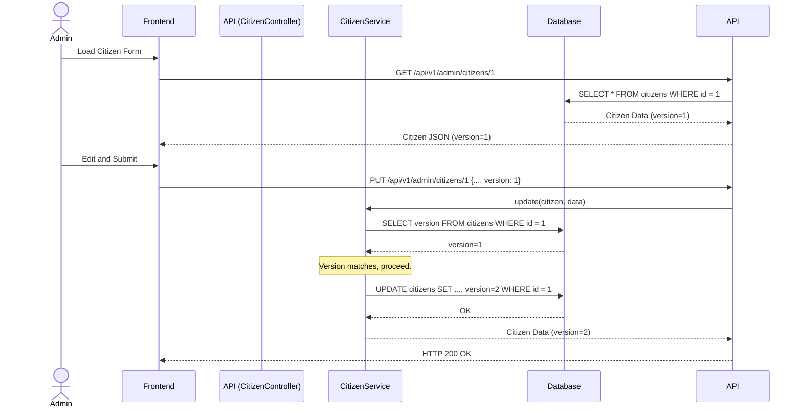
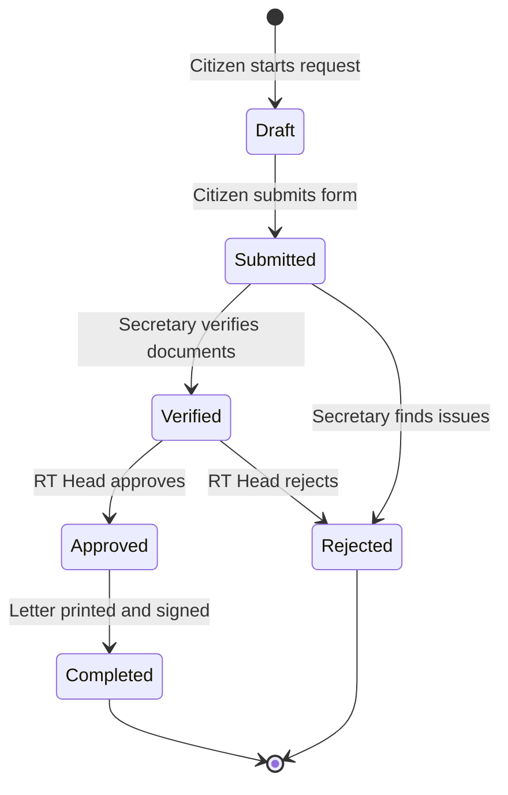

# Architecture and Flow Diagrams

## 1. Sequence Diagram: Optimistic Locking Update

```mermaid
sequenceDiagram
    actor Admin
    participant Frontend
    participant API (CitizenController)
    participant CitizenService
    participant Database

    Admin->>Frontend: Load Citizen Form
    Frontend->>API: GET /api/v1/admin/citizens/1
    API->>Database: SELECT * FROM citizens WHERE id = 1
    Database-->>API: Citizen Data (version=1)
    API-->>Frontend: Citizen JSON (version=1)
    
    Admin->>Frontend: Edit and Submit
    Frontend->>API: PUT /api/v1/admin/citizens/1 {..., version: 1}
    API->>CitizenService: update(citizen, data)
    CitizenService->>Database: SELECT version FROM citizens WHERE id = 1
    Database-->>CitizenService: version=1
    Note over CitizenService: Version matches, proceed.
    CitizenService->>Database: UPDATE citizens SET ..., version=2 WHERE id = 1
    Database-->>CitizenService: OK
    CitizenService-->>API: Citizen Data (version=2)
    API-->>Frontend: HTTP 200 OK
```

## 2. Activity Diagram: Letter Request Approval Workflow

```mermaid
stateDiagram-v2
    [*] --> Draft: Citizen starts request
    Draft --> Submitted: Citizen submits form
    Submitted --> Verified: Secretary verifies documents
    Submitted --> Rejected: Secretary finds issues
    Verified --> Approved: RT Head approves
    Verified --> Rejected: RT Head rejects
    Approved --> Completed: Letter printed and signed
    Completed --> [*]
    Rejected --> [*]
```
