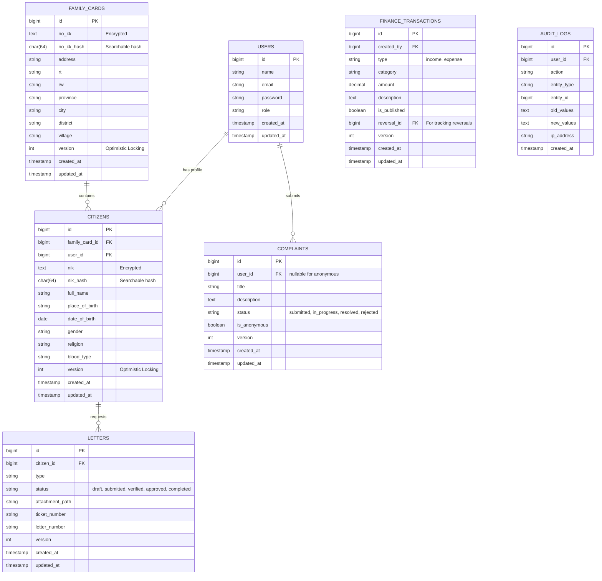

# Entity-Relationship Diagram (ERD)

```mermaid
erDiagram
    USERS ||--o{ CITIZENS : "has profile"
    USERS {
        bigint id PK
        string name
        string email
        string password
        string role
        timestamp created_at
        timestamp updated_at
    }

    FAMILY_CARDS ||--o{ CITIZENS : "contains"
    FAMILY_CARDS {
        bigint id PK
        text no_kk "Encrypted"
        char(64) no_kk_hash "Searchable hash"
        string address
        string rt
        string rw
        string province
        string city
        string district
        string village
        int version "Optimistic Locking"
        timestamp created_at
        timestamp updated_at
    }

    CITIZENS {
        bigint id PK
        bigint family_card_id FK
        bigint user_id FK
        text nik "Encrypted"
        char(64) nik_hash "Searchable hash"
        string full_name
        string place_of_birth
        date date_of_birth
        string gender
        string religion
        string blood_type
        int version "Optimistic Locking"
        timestamp created_at
        timestamp updated_at
    }

    CITIZENS ||--o{ LETTERS : "requests"
    LETTERS {
        bigint id PK
        bigint citizen_id FK
        string type
        string status "draft, submitted, verified, approved, completed"
        string attachment_path
        string ticket_number
        string letter_number
        int version
        timestamp created_at
        timestamp updated_at
    }

    USERS ||--o{ COMPLAINTS : "submits"
    COMPLAINTS {
        bigint id PK
        bigint user_id FK "nullable for anonymous"
        string title
        text description
        string status "submitted, in_progress, resolved, rejected"
        boolean is_anonymous
        int version
        timestamp created_at
        timestamp updated_at
    }

    FINANCE_TRANSACTIONS {
        bigint id PK
        bigint created_by FK
        string type "income, expense"
        string category
        decimal amount
        text description
        boolean is_published
        bigint reversal_id FK "For tracking reversals"
        int version
        timestamp created_at
        timestamp updated_at
    }

    AUDIT_LOGS {
        bigint id PK
        bigint user_id FK
        string action
        string entity_type
        bigint entity_id
        text old_values
        text new_values
        string ip_address
        timestamp created_at
    }
```
