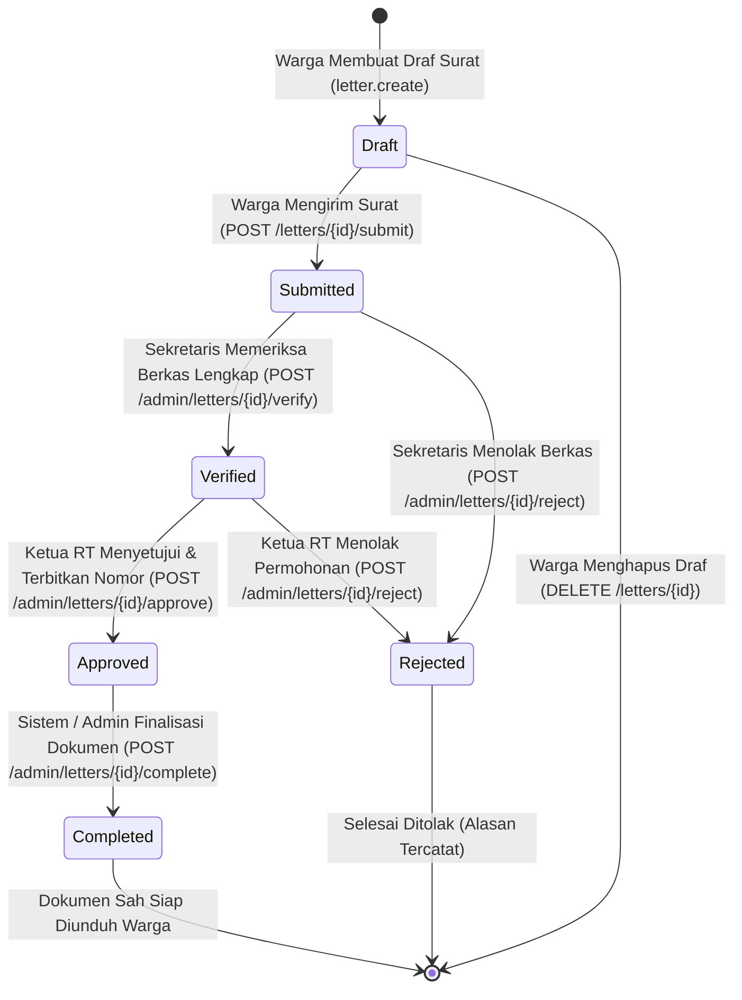

# Alur Kerja Permohonan Surat Resmi (Letter Workflow State Machine)

Dokumen ini menjelaskan alur transisi status (*state machine*), batasan aktor penanggung jawab, pencegahan konflik konkurensi, serta audit trail pada modul permohonan surat warga.

---

## 1. Diagram State Machine Transisi Status Surat



---

## 2. Aturan Transisi Eksplisit & Validasi Wewenang

| Transisi Status | Status Awal | Status Akhir | Aktor Berwenang | Izin Dibutuhkan | Keterangan & Tindakan Sistem |
| :--- | :---: | :---: | :--- | :--- | :--- |
| **Pengajuan** | `draft` | `submitted` | Warga Pemilik | Ownership | Berkas dikirim ke antrean verifikasi sekretariat. |
| **Verifikasi** | `submitted` | `verified` | Sekretaris | `letter.verify` | Pemeriksaan kelengkapan dokumen KTP/KK/Lampiran. |
| **Persetujuan** | `verified` | `approved` | Ketua RT | `letter.approve` | Penomoran surat berurutan bebas tabrakan & token QR. |
| **Penyelesaian** | `approved` | `completed` | Admin / Sistem | `letter.complete` | File HTML/PDF sah dibuat di private storage. |
| **Penolakan Awal** | `submitted` | `rejected` | Sekretaris | `letter.verify` / `reject` | Alasan penolakan (`rejection_reason`) wajib diisi minimal 5 karakter. |
| **Penolakan Akhir** | `verified` | `rejected` | Ketua RT | `letter.approve` / `reject` | Alasan penolakan wajib diisi. |

---

## 3. Transisi Ilegal yang Ditolak Sistem (HTTP 409 Conflict)

Sistem mencegah loncatan tahapan secara ketat (*anti-skip & anti-reversion*):
1. **`draft ➔ approved` (GAGAL):** Surat tidak dapat disetujui tanpa proses verifikasi berkas oleh sekretaris.
2. **`submitted ➔ approved` (GAGAL):** Melewati verifikasi sekretaris dilarang.
3. **`approved ➔ verified` (GAGAL):** Surat yang telah disetujui tidak dapat diturunkan kembali statusnya ke verifikasi.
4. **`completed ➔ draft` (GAGAL):** Surat yang sudah final tidak dapat diubah kembali menjadi draf.
5. **`rejected ➔ approved` (GAGAL):** Surat yang ditolak harus diajukan ulang melalui draf permohonan baru.

---

## 4. Mekanisme Keamanan Konkurensi & Optimistic Locking

* **Optimistic Locking:**
  Setiap baris data surat dilengkapi kolom `version` (bilangan bulat bertambah 1 setiap kali pembaruan berhasil). Setiap permintaan perubahan status wajib menyertakan versi data saat ini (`version`). Apabila versi yang dikirim klien berbeda dari database, sistem menolak dengan **`409 Conflict`**.
* **Pencegahan Nomor Surat Duplikat (*Concurrency-Safe Numbering*):**
  Alih-alih menggunakan `count() + 1` yang rentan terhadap *race condition*, sistem menggunakan tabel **`document_sequences`** dengan penguncian baris transaksi database (**`lockForUpdate()`**):
  ```sql
  SELECT * FROM document_sequences WHERE document_type = 'SK' AND year = 2026 AND month = 10 FOR UPDATE;
  ```
  Ini menjamin penomoran surat resmi (`SK/0001/RT01/10/2026`, `SK/0002/...`) selalu unik dan urut secara atomik.

---

## 5. Jejak Rekam Audit (*Audit Trail*)

Setiap transisi status surat dicatat secara permanen pada tabel `audit_logs` dengan payload nilai lama (*old_values*) dan nilai baru (*new_values*):
* `letter.created`: Pembuatan draf pertama kali.
* `letter.submitted`: Pengiriman permohonan oleh warga.
* `letter.verified`: Verifikasi berkas oleh sekretaris.
* `letter.approved`: Persetujuan dan penerbitan nomor surat oleh Ketua RT.
* `letter.document_generated`: Pembangkitan file dokumen resmi dengan hash SHA-256.
* `letter.completed`: Penyelesaian surat siap diunduh warga.
* `letter.rejected`: Penolakan surat beserta alasan tertulis.
