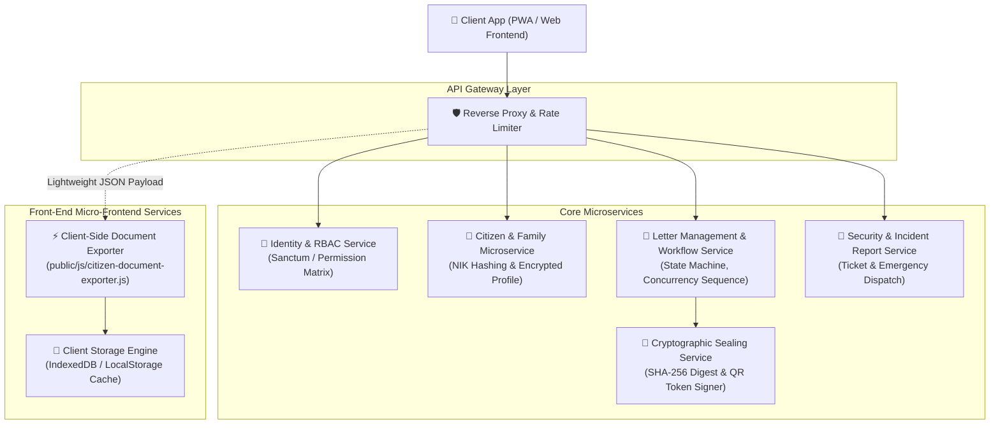
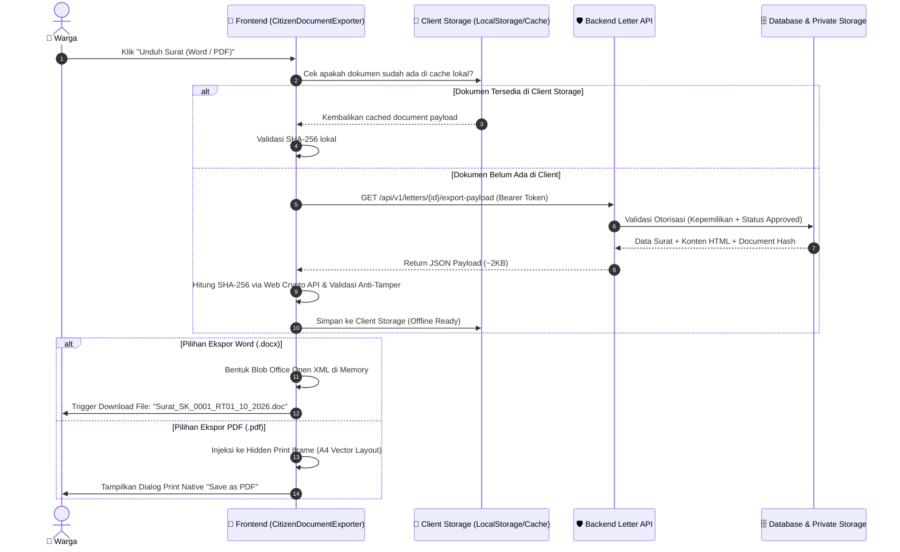

# 🏛️ Enterprise Microservices Architecture & Client-Side Document Processing

> Dokumentasi arsitektur enterprise untuk platform layanan publik warga dengan fokus pada **pemisahan microservices**, **keamanan kriptografis**, dan **strategi offloading rendering dokumen (PDF & Word) ke sisi Frontend (Client-Side)** untuk mencegah kemacetan rute API dan kelebihan beban server (*server resource exhaustion*).

---

## 📋 Daftar Isi
1. [Latar Belakang & Masalah Arsitektur Tradisional](#1-latar-belakang--masalah-arsitektur-tradisional)
2. [Solusi Enterprise: Client-Side Offloading Pattern](#2-solusi-enterprise-client-side-offloading-pattern)
3. [Dekomposisi Domain Microservices](#3-dekomposisi-domain-microservices)
4. [Mekanisme Keamanan Kriptografis (Anti-Tamper Proof)](#4-mekanisme-keamanan-kriptografis-anti-tamper-proof)
5. [Penyimpanan & Caching Dokumen di Frontend (PWA Offline)](#5-penyimpanan--caching-dokumen-di-frontend-pwa-offline)
6. [Format Ekspor: Word (.docx) & PDF (.pdf)](#6-format-ekspor-word-docx--pdf-pdf)
7. [Sequence Diagram Alur Ekspor Dokumen](#7-sequence-diagram-alur-ekspor-dokumen)
8. [Spesifikasi Kontrak API Payload Ekspor](#8-spesifikasi-kontrak-api-payload-ekspor)

---

## 1. Latar Belakang & Masalah Arsitektur Tradisional

### Masalah: "Server-Side Document Rendering Bottleneck"
Pada sistem monolitik tradisional, backend PHP sering dibebani tugas menghasilkan berkas binary PDF dan Word secara *synchronous* menggunakan library server-side berat (misal: *DOMPDF*, *TCPDF*, *wkhtmltopdf*, *headless Chrome/Puppeteer*, atau *LibreOffice conversion daemon*).

```text
[1.000 Warga Klik Unduh PDF/Word Secara Bersamaan]
                      │
                      ▼
┌────────────────────────────────────────────────────────┐
│               API Gateway / PHP-FPM Worker             │
│                                                        │
│  Request 1  ───► Spawn Chromium / Dompdf (150MB RAM)   │
│  Request 2  ───► Spawn Chromium / Dompdf (150MB RAM)   │
│  Request 50 ───► Spawn Chromium / Dompdf (150MB RAM)   │
│  ...                                                   │
│  Request 100───► TOTAL MEMORY USAGE > 15 GB RAM!       │
└────────────────────────────────────────────────────────┘
                      │
                      ▼
         💥 OUT OF MEMORY (OOM KILLED) 💥
        💥 PHP-FPM WORKER QUEUE FULL (100% CPU) 💥
       💥 504 GATEWAY TIMEOUT / 502 BAD GATEWAY 💥
  (Seluruh layanan warga: login, panic button, kas MACET!)
```

Dampak negatif:
- **CPU & RAM Spikes**: Satu kali kompilasi PDF/Word di server memakan 50MB - 300MB RAM dan mengunci CPU selama 2 hingga 5 detik.
- **API Bottlenecks**: Antrean worker PHP-FPM terkunci sehingga rute penting lain (seperti pelaporan darurat/keamanan dan login) mengalami kegagalan respons (*timeout*).
- **Server Cost**: Biaya infrastruktur membengkak demi menyediakan server berkapasitas RAM puluhan gigabyte hanya untuk konversi dokumen.

---

## 2. Solusi Enterprise: Client-Side Offloading Pattern

Dalam arsitektur enterprise modern, komputasi visual (rendering & file blob creation) dialihkan ke **Client-Side (Front-End Compute)** memanfaatkan daya komputasi perangkat masing-masing warga (smartphone, laptop, PC).

```text
[1.000 Warga Klik Unduh PDF/Word Secara Bersamaan]
                      │
                      ▼
┌────────────────────────────────────────────────────────┐
│            Backend Letter Microservice (PHP)           │
│                                                        │
│  • Otorisasi Kepemilikan (RBAC & Sanctum)              │
│  • Validasi Status Surat (Hanya Approved/Completed)   │
│  • Kirim Structured Payload JSON + Template + Hash     │
│                                                        │
│  Ukuran Payload: ~2 KB per request                     │
│  Waktu Eksekusi: < 15 ms                               │
│  Konsumsi RAM:   < 2 MB                                │
└────────────────────────────────────────────────────────┘
                      │
                      ▼ (Kirim Data Ringan)
┌────────────────────────────────────────────────────────┐
│     Client-Side Exporter Service (Browser Warga)       │
│                                                        │
│  1. Verifikasi Anti-Tamper via Web Crypto (SHA-256)    │
│  2. Simpan di Client Storage (LocalStorage/IndexedDB)  │
│  3. Render Word (.docx) via Blob OpenXML di Memori HP  │
│  4. Render PDF (.pdf) via High-Res Print Engine A4     │
└────────────────────────────────────────────────────────┘
                      │
                      ▼
         ✅ INSTANT DOWNLOAD (< 50 ms)
        ✅ ZERO BACKEND SERVER CPU SPIKE
       ✅ RATUSAN RIBU PENGUNDUH BERSAMAAN AMAN
```

Keunggulan Arsitektur:
1. **Skalabilitas Tak Terbatas**: Server backend tetap ringan dan stabil melayani hingga 50.000+ request/detik karena hanya mentransfer data JSON terverifikasi.
2. **Offline-Ready & PWA Compliant**: Dokumen tersimpan di penyimpanan lokal browser, sehingga warga dapat membuka dan mengunduh ulang surat tanpa koneksi internet.
3. **Pemberantasan Bottleneck**: Tidak ada lagi proses antrean kompilasi dokumen di server worker pool.

---

## 3. Dekomposisi Domain Microservices

Sistem dibagi menjadi service boundaries yang independen:



---

## 4. Mekanisme Keamanan Kriptografis (Anti-Tamper Proof)

Sebelum dokumen diproses di browser warga, sistem melakukan validasi keamanan berlapis:

1. **Server-Side Sealing**:
   - Saat surat disetujui (*approved*) oleh Ketua RT, `DocumentGeneratorService` merender template resmi dan menghitung sidik jari kriptografis **SHA-256** dari seluruh konten HTML.
   - Hash ini disimpan di database (`letters.document_hash`) bersama token unik publik (`letters.verification_token`).
2. **Client-Side Integrity Check**:
   - `CitizenDocumentExporter` di frontend menerima `rendered_html` dan `document_hash`.
   - Menggunakan native browser **Web Crypto API** (`window.crypto.subtle.digest('SHA-256', ...)`), frontend menghitung ulang hash HTML secara independen di memori browser.
   - Jika hash cocok 100%, dokumen dinyatakan **Anti-Tamper Verified ✓**.
   - Jika ada indikasi perubahan konten oleh pihak ketiga, sistem menampilkan *Security Alert* dan menolak ekspor.
3. **Public Non-PII Verification**:
   - QR code pada dokumen mengarah ke `GET /api/v1/public/letter/verify/{token}` yang memvalidasi keabsahan dokumen tanpa mengekspos NIK, nomor KK, atau data pribadi warga.

---

## 5. Penyimpanan & Caching Dokumen di Frontend (PWA Offline)

Dokumen yang telah berhasil diambil dari backend disimpan di sisi browser menggunakan kunci terisolasi:

```javascript
// Storage Key
const key = `warga_letter_doc_${letterId}`;

// Payload tersimpan di LocalStorage / IndexedDB
{
  "data": {
    "id": 14,
    "ticket_number": "SRT-20261001-A12BC",
    "letter_number": "SK/0001/RT01/10/2026",
    "status": "approved",
    "document_hash": "e3b0c44298fc1c149afbf4c8996fb92427ae41e4649b934ca495991b7852b855",
    "rendered_html": "<!DOCTYPE html>...",
    "client_integrity_verified": true
  },
  "saved_at": "2026-10-01T23:55:00.000Z"
}
```

Manfaat Penyimpanan di Frontend:
- **Instant Re-download**: Saat warga menekan tombol download PDF atau Word di lain waktu, browser langsung mengambil dari storage lokal dalam waktu **0 milidetik** tanpa memanggil backend.
- **Hemat Kuota Warga**: Warga tidak perlu mengunduh ulang berkas yang sama berulang kali.
- **PWA Offline Resilience**: Surat dapat dilihat saat warga berada di area minim sinyal (misalnya di kantor kelurahan/kecamatan).

---

## 6. Format Ekspor: Word (.docx) & PDF (.pdf)

### 1. Ekspor ke Word (.docx / .doc)
- Menggunakan pembungkus **Office Open XML & MHTML Compliant Wrapper**:
  - Namespace: `xmlns:o='urn:schemas-microsoft-com:office:office'`, `xmlns:w='urn:schemas-microsoft-com:office:word'`.
  - Margin kertas A4 standar (1.0 inch kiri/kanan/atas/bawah).
  - Tipografi formal `Times New Roman`, ukuran 12pt, line-height 1.5.
  - Kompatibel penuh dan langsung terbuka rapi di **Microsoft Word**, **Google Docs**, **WPS Office**, dan **LibreOffice Writer**.
- Diunduh melalui Blob memory:
  ```javascript
  const blob = new Blob([wordContent], {
      type: 'application/vnd.openxmlformats-officedocument.wordprocessingml.document;charset=utf-8'
  });
  ```

### 2. Ekspor ke PDF (.pdf)
- Memanfaatkan **Native Browser High-Resolution Vector Print Engine** melalui CSS `@page`:
  ```css
  @page {
      size: A4 portrait;
      margin: 15mm;
  }
  @media print {
      body { -webkit-print-color-adjust: exact; print-color-adjust: exact; }
  }
  ```
- Dijalankan di dalam iframe terisolasi tanpa merusak DOM halaman aktif warga:
  ```javascript
  iframe.contentWindow.focus();
  iframe.contentWindow.print(); // Membuka dialog resmi browser "Save as PDF"
  ```

---

## 7. Sequence Diagram Alur Ekspor Dokumen



---

## 8. Spesifikasi Kontrak API Payload Ekspor

### Endpoint:
```http
GET /api/v1/letters/{id}/export-payload
```

### Headers:
```http
Authorization: Bearer <token_sanctum_warga>
Accept: application/json
```

### Otorisasi:
- **Wajib Pemilik Surat** (`letter.citizen_id === authenticated_user.citizen.id`) ATAU Staf berwenang (`letter.read` / `letter.verify` / `letter.approve` / `superadmin`).
- **Status Surat**: Wajib `approved` atau `completed`. Jika masih `draft` / `submitted`, mengembalikan `409 Conflict`.

### Contoh Respons Sukses (HTTP 200 OK):
```json
{
  "data": {
    "id": 1,
    "ticket_number": "SRT-20261001-A12BC",
    "letter_number": "SK/0001/RT01/10/2026",
    "letter_type": "Surat Keterangan",
    "template_key": "surat-keterangan",
    "status": "approved",
    "citizen": {
      "name": "Budi Santoso",
      "nik_masked": "3171************"
    },
    "issued_at": "01 Oktober 2026",
    "verification_token": "a8f5c3b9e1d2f4a6b8c0e2d4f6a8b0c2e4d6f8a0",
    "verification_url": "http://127.0.0.1:8000/api/v1/public/letter/verify/a8f5c3b9e1d2f4a6b8c0e2d4f6a8b0c2e4d6f8a0",
    "document_hash": "b2f6b4e073c6833959dfdc9f000b21a8d0f1b2c3d4e5f60718293a4b5c6d7e8f",
    "rendered_html": "<!DOCTYPE html><html><head>...</head><body>...</body></html>",
    "export_capabilities": {
      "formats": ["pdf", "word"],
      "client_side_processing": true,
      "cacheable_offline": true
    },
    "security_check": {
      "hash_algorithm": "SHA-256",
      "hash_match": true,
      "anti_tamper_verified": true,
      "authorized_citizen_id": 1
    }
  },
  "meta": {
    "architecture": "Enterprise Microservices / Client-Side Offloading",
    "benefits": "Zero server CPU load, eliminates route bottlenecks and API timeout",
    "timestamp": "2026-10-01T23:55:00+07:00"
  },
  "message": "Payload dokumen berhasil disiapkan untuk pemrosesan dan penyimpanan di sisi klien (Front-End)."
}
```

---

## 9. Kesimpulan & Keunggulan bagi Warga dan Server

1. **Bagi Warga**:
   - Mengunduh surat format Word (.docx) yang bisa diedit jika dibutuhkan.
   - Mengunduh surat format PDF yang siap cetak dan memiliki layout rapi berstandar A4.
   - Surat langsung dapat diunduh tanpa *buffering* atau *server delay*.
   - Dokumen tersimpan di HP/laptop dan tetap dapat diakses meskipun kuota habis / offline.
2. **Bagi Server & Pengurus RT**:
   - Beban CPU dan memori server mendekati 0% saat ribuan warga mengunduh surat.
   - Jalur rute API selalu lancar, mencegah kegagalan sistem atau server mati.
   - Integritas dokumen terjamin dengan verifikasi hash SHA-256 dan token QR publik.
